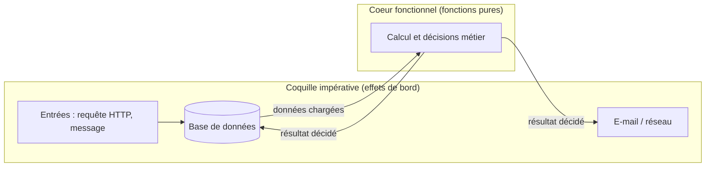
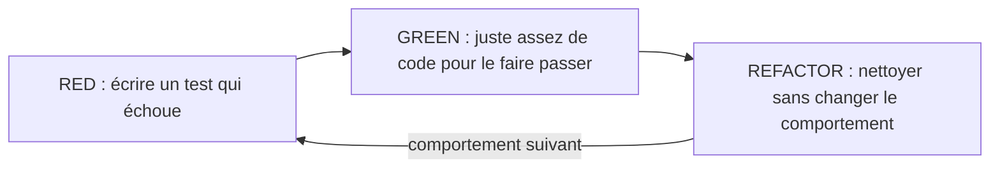
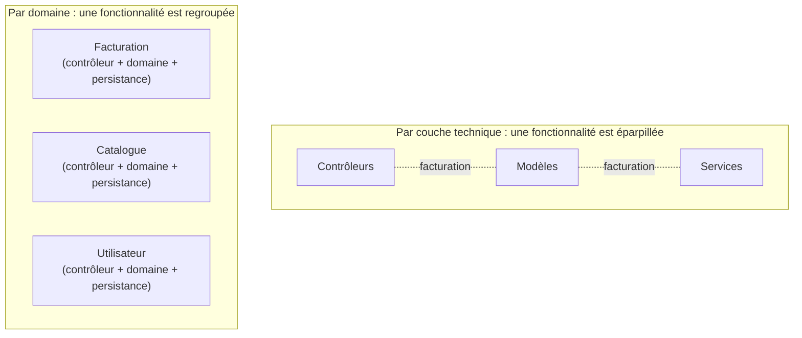
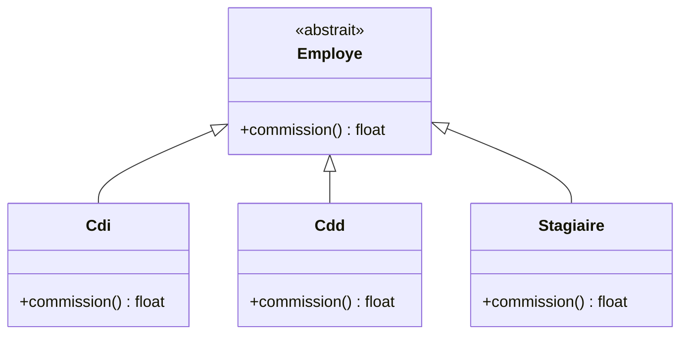

# [Tansoftware](https://www.tansoftware.com) - Clean Code [](README.md)

[](LICENSE) [](#) [](#) [](#)

## Table des matières

* [Introduction](#introduction)
* [Glossaire](#glossaire)
* [Nommage des variables](#nommage-des-variables)
* [Commentaires](#commentaires)
* [Mise en forme du code (formatage)](#mise-en-forme-du-code-formatage)
* [Fonctions courtes et spécifiques](#fonctions-courtes-et-spécifiques)
* [Respect des conventions de codage](#respect-des-conventions-de-codage)
* [Duplication](#duplication)
* [Objets vs structures de données](#objets-vs-structures-de-données)
* [Loi de Déméter et Tell, Don't Ask](#loi-de-déméter-et-tell-dont-ask)
* [Fonctions pures et effets de bord](#fonctions-pures-et-effets-de-bord)
* [Utilisation de tests unitaires](#utilisation-de-tests-unitaires)
* [Tests : principes F.I.R.S.T. et TDD](#tests--principes-first-et-tdd)
* [Documentation de code](#documentation-de-code)
* [Gestion des erreurs et des exceptions](#gestion-des-erreurs-et-des-exceptions)
* [Structure du code claire et organisée](#structure-du-code-claire-et-organisée)
* [Gestion des dépendances](#gestion-des-dépendances)
* [Gestion de la complexité du code](#gestion-de-la-complexité-du-code)
* [Les fonctions doivent faire une seule chose](#les-fonctions-doivent-faire-une-seule-chose)
* [Code smells (mauvaises odeurs de code)](#code-smells-mauvaises-odeurs-de-code)
* [Catalogue de refactorings essentiels](#catalogue-de-refactorings-essentiels)
* [Boy Scout Rule en pratique](#boy-scout-rule-en-pratique)
* [Revue de code : hygiène et fond](#revue-de-code--hygiène-et-fond)
* [Outillage PHP : du linter au mutation testing](#outillage-php--du-linter-au-mutation-testing)
* [Quand ne pas appliquer Clean Code](#quand-ne-pas-appliquer-clean-code)
* [KISS, YAGNI et optimisation prématurée](#kiss-yagni-et-optimisation-prématurée)
* [Dette technique](#dette-technique)
* [Pour aller plus loin](#pour-aller-plus-loin)

## Introduction

Le terme *Clean Code* (« code propre ») a été popularisé par [Robert C. Martin](https://fr.wikipedia.org/wiki/Robert_C._Martin) dans son livre *Clean Code: A Handbook of Agile Software Craftsmanship* (2008). Il regroupe un ensemble de pratiques qui rendent le code plus lisible, plus facile à modifier et moins coûteux à maintenir.

Un code est dit *propre* lorsqu'un développeur autre que son auteur peut le lire, le comprendre et le faire évoluer sans avoir à mener l'enquête. Les exemples qui suivent sont écrits en PHP, mais les principes valent pour tout langage.

> **Que veut dire « PHP » ?** *PHP* (à l'origine *Personal Home Page*, aujourd'hui *PHP: Hypertext Preprocessor*) est un langage de programmation très répandu pour construire des sites et des applications web côté serveur (la partie qui tourne sur la machine qui héberge le site, par opposition à ce qui tourne dans le navigateur). En PHP, le signe `$` placé devant un mot signale une **variable**, c'est-à-dire une boîte qui contient une valeur. Quand vous lisez `$age` dans un bloc de code, lisez « la variable nommée age » : ce n'est pas une formule de mathématiques.

> **Que veut dire « maintenir » du code ?** *Maintenir* un logiciel, c'est continuer à le faire vivre après sa première écriture : corriger des bugs, ajouter des fonctionnalités, l'adapter à de nouveaux besoins. Pensez à l'entretien d'une maison : on n'arrête pas de s'en occuper une fois construite. La plupart du coût d'un logiciel se trouve dans cette phase d'entretien, pas dans l'écriture initiale ; voilà pourquoi la lisibilité compte autant.

> *« La règle du boy scout : laissez le campement plus propre que vous ne l'avez trouvé. »* (Robert C. Martin)
>
> Appliquée au code, cette règle pousse à améliorer un peu chaque fichier que l'on touche, plutôt que d'attendre une refonte hypothétique.

[🔝 Retour en haut de page](#table-des-matières)

## Glossaire

Le vocabulaire ci-dessous revient à plusieurs endroits. Chaque terme est aussi réexpliqué, avec une analogie, à sa première apparition dans le texte. Le tableau sert d'aide-mémoire auquel revenir au besoin.

| Terme | Définition courte | Pourquoi c'est utile |
|-------|-------------------|----------------------|
| **SRP** (*Single Responsibility Principle*, principe de responsabilité unique) | Une classe ou une fonction ne doit avoir qu'**une seule raison de changer**. | Un module qui répond à plusieurs raisons de changer concentre des risques de régression à chaque évolution. |
| **Cohésion** | Mesure du degré auquel les éléments d'un module (méthodes, attributs) participent à une **même finalité**. Forte cohésion = bon signe. | Une classe cohésive est facile à nommer, à tester, à comprendre. |
| **Couplage** | Mesure de la dépendance entre deux modules. Faible couplage = bon signe. | Moins deux modules se connaissent, plus on peut les modifier indépendamment. |
| **Magic number** (nombre magique) | Valeur littérale (`30`, `0.2`, `0.07`) inscrite dans le code sans nom ni explication. | Les remplacer par une constante nommée (`DELAI_PURGE_JOURS`, `TAUX_TVA`) rend l'intention explicite. |
| **Code smell** (mauvaise odeur de code) | Indice visuel qu'une portion de code mériterait un refactoring. Une *odeur* n'est pas un bug : c'est un signal. | Catalogue popularisé par Martin Fowler et Kent Beck dans *Refactoring*. |
| **Refactoring** (refactorisation) | Transformation **sans changement de comportement** observable, qui améliore la structure interne. | Permet d'améliorer la lisibilité ou la conception sans risque fonctionnel, à condition d'avoir des tests. |
| **DRY** (*Don't Repeat Yourself*) | Une règle ou une connaissance ne doit avoir qu'une seule source faisant autorité dans le système. | Évite la dérive entre copies et la duplication de la maintenance. |
| **KISS** (*Keep It Simple, Stupid*) | Préférer la solution la plus simple qui répond au besoin **actuel**. | La complexité gratuite est de la dette qui ne rend rien. |
| **YAGNI** (*You Aren't Gonna Need It*) | Ne pas implémenter ce dont on n'a **pas encore** besoin. | Évite le code mort, les options non testées, les chemins jamais empruntés. |
| **Optimisation prématurée** | Performances cherchées avant qu'un profilage ait identifié un goulot réel. Donald Knuth la qualifie de « racine de tout mal ». | Tordre la lisibilité pour un gain non mesuré coûte plus qu'il ne rapporte. |
| **Dette technique** | Coût futur d'un raccourci pris aujourd'hui (mauvais nom, copier-coller, test absent). Métaphore de Ward Cunningham. | Comme la dette financière, elle se rembourse avec des intérêts. |
| **Encapsulation** | Cacher l'état interne d'un objet derrière des méthodes qui contrôlent son accès et ses transitions. | Empêche les modules extérieurs de dépendre de détails internes susceptibles de changer. |
| **Polymorphisme** | Capacité, pour différentes classes partageant la même interface, de répondre à un même appel par leur propre comportement. | Remplace les longues cascades `if/else` ou `switch` par une dispatch implicite. |
| **Effet de bord** (*side effect*) | Toute action d'une fonction au-delà du retour de sa valeur : écrire un fichier, modifier un attribut, journaliser, envoyer un mail. | Les effets de bord rendent les fonctions difficiles à tester et à raisonner ; à isoler. |
| **Fonction pure** | Fonction sans effet de bord dont le résultat ne dépend que des arguments. Mêmes entrées = mêmes sorties. | Trivialement testable, mémoïsable, parallélisable. |
| **Loi de Déméter** | « Ne parler qu'à ses amis directs. » Un objet ne doit pas naviguer dans la structure interne d'un autre via des chaînes `a.b.c.d`. | Réduit le couplage et la fragilité aux changements internes. |
| **Tell, Don't Ask** | Plutôt qu'**interroger** un objet pour décider à sa place, **lui dire** quoi faire. | Concentre le comportement dans l'objet qui détient les données. |
| **CQS** (*Command-Query Separation*) | Une méthode est soit une **commande** (effet, retour `void`) soit une **requête** (lecture sans effet). Pas les deux. | Évite les surprises (« lire change l'état »). |
| **Clause de garde** (*guard clause*) | `if (...) return;` ou `throw` placé en début de fonction pour éliminer un cas particulier. | Aplanit l'imbrication, met le cas nominal au premier niveau. |

[🔝 Retour en haut de page](#table-des-matières)

## Nommage des variables

Un nom doit révéler l'intention : pourquoi cette variable existe-t-elle, et que représente-t-elle ? Un nom mal choisi force le lecteur à reconstruire le contexte ; un nom précis le lui sert directement.

| Catégorie | À éviter | À préférer | Pourquoi |
|-----------|----------|------------|----------|
| Variable simple | `$a`, `$d` | `$age`, `$dureeEnSecondes` | Le nom doit dire *quoi* et *dans quelle unité*. |
| Fonction | `foo()`, `process()` | `calculerTotal()`, `validerEmail()` | Un verbe d'action décrit ce que la fonction fait. |
| Classe | `Manager`, `MyClass` | `CommandeClient`, `FactureRepository` | Un nom (substantif) décrit la responsabilité. |
| Constante | `X = 3` | `MAX_TENTATIVES = 3` | Majuscules et nom décrivant la limite, pas la valeur. |
| Booléen | `$flag`, `$check` | `$estConnecte`, `$peutModifier` | Préfixer par `est`, `a`, `peut` pour signaler un booléen. |
| Tableau | `$arr`, `$data` | `$utilisateurs`, `$lignesFacture` | Un pluriel signale une collection. |
| Argument | `$arg1`, `$x` | `$prenom`, `$montantTtc` | Le nom dans la signature documente l'API. |

### Les sept règles de nommage de *Clean Code* (chapitre 2)

| Règle | Idée | Exemple à éviter | Exemple à préférer |
|-------|------|------------------|---------------------|
| Révéler l'intention | Le nom répond à *pourquoi*, *quoi*, *comment l'utiliser*. | `$d` (jours ? distance ?) | `$delaiAvantPurgeEnJours` |
| Éviter la désinformation | Pas de nom qui ment sur le type ou la nature. | `$accountList` (qui est en fait un `array` non ordonné) | `$comptes` |
| Distinguer significativement | Pas de variantes vides (`data1`, `data2`, `info`, `infoData`). | `getActiveAccount()`, `getActiveAccounts()`, `getActiveAccountInfo()` | `getCompteActif()`, `getComptesActifs()` |
| Prononçable | On doit pouvoir en parler à voix haute. | `$genymdhms` | `$dateDeGeneration` |
| Recherchable | Les noms courts ne se cherchent pas dans un éditeur (`grep e` retourne tout). | `7` (taux de TVA dispersé) | `const TAUX_TVA = 0.20;` |
| Sans encodage | Pas de notation hongroise (`strNom`, `iCount`), pas de préfixe `m_`. PHP est typé : laissez les types au compilateur. | `string $strNom` | `string $nom` |
| Sans mapping mental | Le lecteur ne doit pas avoir à traduire `r` en *« le résultat retourné »*. | `for ($i = 0; …) { $r += $a[$i]; }` | `foreach ($valeurs as $valeur) { $somme += $valeur; }` |

### Quand assouplir

Les noms courts (`i`, `j`, `n`) restent acceptables pour des indices de boucle locale. Les abréviations consacrées dans le domaine (`url`, `id`, `http`) sont également admises ; elles trompent moins qu'une expansion artificielle (`uniformResourceLocator`).

### Heuristiques tirées des bases de code PHP réelles

> **Que veut dire « heuristique » ?** Une *heuristique* est une règle approximative, tirée de l'expérience, qui marche dans la plupart des cas sans être une loi absolue. « Si une fonction dépasse l'écran, elle fait sans doute trop de choses » est une heuristique : un bon indice à vérifier, pas une vérité mécanique. Pensez au dicton « ciel rouge le soir, beau temps en perspective » : souvent vrai, pas garanti.

> **Que veut dire « PSR » ?** *PSR* signifie *PHP Standard Recommendation* (« recommandation standard PHP »). Ce sont des règles communes, publiées par un groupe de mainteneurs de projets PHP (le PHP-FIG), pour que tout le monde écrive le code de la même façon : nommage, indentation, organisation des fichiers. Numérotées (PSR-1, PSR-4, PSR-12...), elles jouent le rôle d'un code de la route partagé : chacun roule du même côté, donc tout le monde se comprend.

> **Que veut dire « Symfony », « Laravel », « Doctrine » ?** Ce sont des bibliothèques PHP très répandues. *Symfony* et *Laravel* sont des **frameworks** (des squelettes prêts à l'emploi qui fournissent l'ossature d'une application web, pour éviter de tout réécrire). *Doctrine* est un **ORM**, un outil qui fait le pont entre les objets du code et les tables d'une base de données.

Les conventions ci-dessous ne sont écrites nulle part dans les PSR mais s'imposent par usage dans Symfony, Laravel, Doctrine, et la plupart des projets PHP modernes.

| Heuristique | Énoncé | Exemple |
|-------------|--------|---------|
| **Verbe en tête pour les méthodes** | Une méthode *fait* quelque chose : son nom commence par un verbe d'action. | `calculerTotal()`, `valider()`, `enregistrer()`. |
| **Substantif pour les variables et propriétés** | Une variable *est* une chose : son nom est un nom commun. | `$client`, `$lignesCommande`, `$dateLivraison`. |
| **Préfixe booléen** | Un booléen pose une question : `est`, `a`, `peut`, `doit`. | `$estActif`, `aDroitsAdmin`, `peutPublier()`. |
| **Pluriel = collection** | Un nom au pluriel signale une collection (tableau, `Collection`, `iterable`). | `$utilisateurs`, `$factures`. |
| **Suffixe métier pour les classes techniques** | Le rôle architectural se devine au suffixe. | `UserRepository`, `OrderController`, `EmailValidator`, `ShippingFactory`. |
| **`make` / `create` / `new` pour les fabriques** | Distingue les méthodes *fabriques* du reste. | `make()`, `createFromArray()`, `newFromRequest()`. |
| **`from` / `to` pour les conversions** | Met en valeur la transformation entre formats. | `Email::fromString()`, `$invoice->toArray()`. |

> **Que veut dire « notation hongroise » ?** C'est une vieille habitude qui consiste à coller au nom d'une variable une abréviation de son type : `strNom` pour une chaîne (*string*), `iCount` pour un entier (*integer*), `arrLignes` pour un tableau (*array*). Elle vient d'une époque où les éditeurs n'affichaient pas le type. Aujourd'hui l'éditeur le montre tout seul, donc cette notation ne fait qu'ajouter du bruit : si le type change, le nom ment.

**À éviter en PHP moderne :**

* **Notation hongroise** (`strNom`, `iCount`, `arrLignes`). PHP est typé statiquement (depuis 7.0 sur les arguments, depuis 7.4 sur les propriétés) ; les types sont déjà dans la signature et dans l'IDE. Préfixer le type au nom est du bruit.

> **Que veut dire « IDE » et « typé statiquement » ?** Un *IDE* (*Integrated Development Environment*, « environnement de développement intégré ») est l'éditeur évolué dans lequel on écrit le code : il complète les noms, signale les erreurs au survol, et affiche le type des variables. *Typé statiquement* signifie que l'on déclare à l'avance la nature de chaque donnée (texte, entier, etc.) et que des outils vérifient la cohérence avant même l'exécution, ce qui attrape beaucoup d'erreurs tôt. Puisque l'IDE montre déjà le type, le répéter dans le nom est inutile.
* **Préfixe `m_`** pour les attributs (héritage C++/MFC). Les attributs de classe sont déjà signalés par `$this->` à l'usage.
* **Suffixe `_obj`** ou `_var`. Tautologie : `$client_obj` est aussi vide d'information que `$la_chose`.
* **Anglais bricolé** mêlé au français. Choisir une langue par projet, pas par fichier. Le domaine métier en français + termes techniques en anglais (`Repository`, `Controller`) est un compromis fréquent et acceptable.

### Magic numbers : nommer les littéraux

```php
// À éviter
if ($commande->total() > 100 && $client->ancienneteEnAnnees() >= 2) {
    $remise = $commande->total() * 0.07;
}

// À préférer
const SEUIL_REMISE_FIDELITE = 100;
const ANCIENNETE_MINIMALE_EN_ANNEES = 2;
const TAUX_REMISE_FIDELITE = 0.07;

if ($commande->total() > SEUIL_REMISE_FIDELITE
    && $client->ancienneteEnAnnees() >= ANCIENNETE_MINIMALE_EN_ANNEES) {
    $remise = $commande->total() * TAUX_REMISE_FIDELITE;
}
```

Le second extrait est aussi rapide et révèle la **règle métier**, pas seulement le calcul.

[🔝 Retour en haut de page](#table-des-matières)

## Commentaires

Un bon commentaire explique *pourquoi* le code fait ce qu'il fait, jamais *ce qu'il fait* (le code le dit déjà). Avant d'écrire un commentaire, demandez-vous si un meilleur nom de fonction ou de variable ne le rendrait pas inutile.

### À éviter

```php
// Incrémenter i
$i++;

// Vérifier si l'utilisateur est admin
if ($user->role === 'admin') { ... }
```

### À préférer

```php
$i++;

if ($user->estAdministrateur()) { ... }

// La règlementation RGPD impose un délai de purge de 30 jours minimum.
const DELAI_PURGE_JOURS = 30;
```

> **Que veut dire « RGPD » ?** *RGPD* signifie *Règlement général sur la protection des données* (en anglais *GDPR*). C'est une loi européenne qui encadre la manière dont les entreprises collectent et conservent les données personnelles (nom, adresse, e-mail). Concrètement, elle impose par exemple de ne pas garder ces données plus longtemps que nécessaire. Quand une telle règle vient d'une loi extérieure au code, un commentaire est utile : le code seul ne peut pas expliquer *pourquoi* le délai vaut 30 jours et pas 7.

| Type de commentaire | Utile ? | Raison |
|---------------------|---------|--------|
| Justification d'un choix non évident | Oui | Le code montre le *quoi*, pas le *pourquoi*. |
| Référence à une norme, un ticket, une RFC | Oui | Aide le futur lecteur à retrouver le contexte. |
| Avertissement (effet de bord, perf, ordre d'appel) | Oui | Évite des bugs subtils. |
| Paraphrase du code | Non | Bruit ; sera désynchronisé tôt ou tard. |
| TODO sans responsable ni date | Non | Reste *ad vitam æternam* ; préférer un ticket. |

> **Que veut dire « RFC » ?** *RFC* signifie *Request For Comments* (« appel à commentaires »). Ce sont des documents techniques officiels qui définissent les standards d'Internet : comment fonctionne l'e-mail, le web, etc. Chacun porte un numéro (par exemple la RFC 7519 décrit le format de jetons *JWT*). Renvoyer vers une RFC dans un commentaire, c'est citer la source de référence, comme on cite un article de loi.

> **Que veut dire « TODO » ?** *TODO* (« à faire », de l'anglais *to do*) est un commentaire qui marque un travail à terminer plus tard, par exemple `// TODO: gérer le cas du paiement refusé`. Le problème : un TODO sans personne responsable ni date reste là pour toujours. Mieux vaut créer un ticket dans l'outil de suivi de l'équipe, où il sera priorisé et n'oublié.

### Quand commenter abondamment

> **Que veut dire « API » ?** *API* signifie *Application Programming Interface* (« interface de programmation d'application »). C'est la liste des fonctions qu'un morceau de code offre aux autres morceaux de code pour s'en servir, sans avoir à connaître son fonctionnement interne. Analogie : le tableau de bord d'une voiture est une API. Vous tournez le volant et appuyez sur la pédale (les fonctions offertes) sans savoir comment le moteur marche à l'intérieur. Une *API publique*, c'est la partie de votre code que d'autres équipes ou projets vont appeler.

> **Que veut dire « PHPDoc », « JSDoc », « docstring » ?** Ce sont trois formes du même outil selon le langage : un bloc de texte structuré placé juste au-dessus d'une fonction pour décrire ce qu'elle fait, ce qu'elle attend et ce qu'elle renvoie. *PHPDoc* en PHP, *JSDoc* en JavaScript, *docstring* en Python. Les éditeurs de code les affichent automatiquement quand on survole la fonction, comme la notice d'un appareil.

Les API publiques (PHPDoc, JSDoc, docstrings) gagnent à être documentées : leurs utilisateurs ne lisent pas leur implémentation (le code interne), seulement la notice.

### Heuristique générale

> *« Un commentaire est l'aveu qu'on n'a pas su s'exprimer en code. »* (Robert C. Martin)

Avant d'écrire un commentaire, essayez : (1) renommer une variable, (2) extraire une fonction au nom signifiant, (3) introduire une constante. Si le besoin de commenter persiste, alors le commentaire est probablement justifié.

### Nuance : la position de Robert C. Martin est contestée

La formule ci-dessus est l'un des conseils les plus repris (et les plus mal appliqués) de *Clean Code*. Il faut la lire dans son contexte : Martin combat les commentaires **redondants** (« incrémente i »), pas les commentaires en général. Des bases de code reconnues pour leur qualité, comme le **noyau Linux**, **FreeBSD**, **SQLite** ou **PostgreSQL**, sont copieusement commentées, et leurs commentaires sont précisément ce qui les rend abordables à un nouvel arrivant.

Un bon commentaire répond à une question que **ni le code ni les tests ne peuvent répondre** :

| Question à laquelle le code ne répond pas | Exemple de commentaire utile |
|-------------------------------------------|------------------------------|
| Pourquoi cette valeur ? | `// 511 : taille max d'un nom UTF-8 en NTFS, source MSDN.` |
| Pourquoi ce contournement ? | `// Workaround : libxml < 2.9 perd l'encodage en cas d'entité.` |
| Pourquoi cet ordre d'opération ? | `// On purge AVANT d'écrire pour éviter une race avec le worker.` |
| Pourquoi ne pas utiliser X ? | `// array_unique() est O(n²) ici ; map associative manuelle.` |
| Quel papier / RFC / ticket ? | `// Cf. RFC 7519 §4.1.4 (exp claim).` |

Ces commentaires **survivent au refactoring** parce qu'ils décrivent une décision, pas une mécanique. Le test à passer : *« si je supprime ce commentaire, est-ce que le prochain mainteneur perdra une demi-journée à reconstruire le contexte ? »* Si oui, gardez-le.

### Commentaires *de section* dans les fonctions longues : un signal, pas une solution

```php
// À éviter : des commentaires-titres qui découpent une fonction trop longue
public function traiter(): void
{
    // -- Validation --
    // ... 15 lignes
    // -- Calcul --
    // ... 20 lignes
    // -- Persistance --
    // ... 10 lignes
}
```

Ici les commentaires soulignent un découpage qui mérite des **fonctions** (`valider()`, `calculer()`, `enregistrer()`). Le commentaire est alors le symptôme, pas le remède.

[🔝 Retour en haut de page](#table-des-matières)

## Mise en forme du code (formatage)

Le formatage n'est pas cosmétique : il guide le regard du lecteur. Un fichier bien mis en forme se parcourt comme un texte, du plus général (en haut) au plus détaillé (en bas).

### Densité verticale

| Règle | Idée |
|-------|------|
| Lignes vides comme paragraphes | Une ligne vide sépare deux idées ; à l'intérieur d'un bloc, restez denses. |
| Concepts liés rapprochés | Une variable est déclarée près de son premier usage, pas en haut de fonction « comme en C ». |
| Du général au détail | Une classe expose d'abord ses méthodes publiques (le *quoi*), puis ses méthodes privées (le *comment*). |
| Fonctions appelées **après** l'appelant | On lit le fichier comme un journal : titre, paragraphes, sous-paragraphes. |

### Densité horizontale

| Règle | Idée |
|-------|------|
| Lignes courtes (~120 caractères) | Au-delà, l'œil saute des lignes en lisant. |
| Espaces autour des opérateurs | `a + b` se lit mieux que `a+b`. |
| Indentation cohérente | 4 espaces en PHP (PSR-12). Un éditeur correctement configuré rend la règle invisible. |

### Exemple

```php
final class CalculateurRemise
{
    private const SEUIL_FIDELITE = 100;
    private const TAUX_FIDELITE = 0.07;

    public function calculer(Commande $commande, Client $client): Montant
    {
        if (! $this->estEligible($commande, $client)) {
            return Montant::zero();
        }

        return $commande->total()->multiplier(self::TAUX_FIDELITE);
    }

    private function estEligible(Commande $commande, Client $client): bool
    {
        return $commande->total()->superieurA(self::SEUIL_FIDELITE)
            && $client->estFidele();
    }
}
```

L'ordre raconte : « voici la règle (constantes), voici l'API (`calculer`), voici le détail (`estEligible`) ».

### Règles d'équipe avant règles personnelles

Le pire formatage cohérent vaut mieux que le meilleur formatage inconstant. Outils recommandés en PHP : [PHP-CS-Fixer](https://github.com/PHP-CS-Fixer/PHP-CS-Fixer), [PHP_CodeSniffer](https://github.com/PHPCSStandards/PHP_CodeSniffer). Branchez-les en pré-commit pour rendre le débat impossible.

[🔝 Retour en haut de page](#table-des-matières)

## Fonctions courtes et spécifiques

Une fonction doit faire **une seule chose** et la faire à un seul niveau d'abstraction. Robert C. Martin propose comme heuristique : « si vous pouvez extraire une autre fonction avec un nom signifiant, faites-le ».

### À éviter

```php
function traiterCommande(array $commande): void {
    // validation
    if (empty($commande['lignes'])) { throw new RuntimeException('vide'); }
    foreach ($commande['lignes'] as $l) {
        if ($l['quantite'] <= 0) { throw new RuntimeException('quantité'); }
    }
    // calcul
    $total = 0;
    foreach ($commande['lignes'] as $l) {
        $total += $l['prix'] * $l['quantite'];
    }
    // persistance
    $pdo = new PDO(...);
    $pdo->prepare('INSERT ...')->execute([...]);
    // notification
    mail($commande['email'], 'Confirmation', "Total : $total");
}
```

### À préférer

```php
function traiterCommande(Commande $commande): void {
    valider($commande);
    $total = calculerTotal($commande);
    enregistrer($commande, $total);
    notifier($commande, $total);
}
```

Chaque sous-fonction est testable isolément et son nom documente l'étape.

### Niveaux d'abstraction descendants

Une fonction mélange souvent du **quoi** (politique métier) et du **comment** (mécanique technique). Robert C. Martin appelle cela la **règle des niveaux descendants** : à chaque niveau, on doit pouvoir lire la fonction comme une suite de phrases d'**un même niveau d'abstraction**.

```php
// À éviter : trois niveaux mélangés en six lignes
public function expedier(Commande $commande): void
{
    $client = $this->pdo->query('SELECT * FROM clients WHERE id = ' . $commande->clientId())->fetch();
    $this->mailer->envoyer($client['email'], 'Expédiée', 'Votre commande #' . $commande->id() . ' part demain.');
    $commande->marquerCommeExpediee();
    $this->pdo->prepare('UPDATE commandes SET statut = ? WHERE id = ?')->execute(['EXPEDIEE', $commande->id()]);
}
```

```php
// À préférer : chaque ligne raconte une étape, les détails descendent d'un cran
public function expedier(Commande $commande): void
{
    $client = $this->clients->trouverParId($commande->clientId());
    $this->notifierExpedition($client, $commande);
    $this->commandes->marquerExpediee($commande);
}
```

### Préférer peu d'arguments

Plus une fonction prend d'arguments, plus elle est difficile à comprendre, à appeler correctement, à tester. Robert C. Martin propose une échelle :

| Nombre d'arguments | Nom | Recommandation |
|--------------------|-----|----------------|
| 0 | *niladique* | Idéal. |
| 1 | *monadique* | Excellent. |
| 2 | *dyadique* | Acceptable, surtout si l'ordre est naturel (`new Point($x, $y)`). |
| 3 | *triadique* | À justifier ; envisager un objet paramètre. |
| 4 et + | *polyadique* | Presque toujours une *odeur* (« *long parameter list* »). |

#### Introduire un objet paramètre

```php
// Long parameter list : on doit retenir l'ordre, le type, le sens des null
public function creerCommande(
    int $clientId,
    string $deviseIso,
    bool $expressShipping,
    ?string $codePromo,
    ?DateTimeImmutable $dateLivraisonSouhaitee,
): Commande { /* ... */ }

// Mieux : un objet paramètre nommé, immuable, validable
public function creerCommande(NouvelleCommande $payload): Commande { /* ... */ }
```

### Booléens en argument : un drapeau rouge

Un argument booléen indique souvent que la fonction fait **deux choses**. Préférez deux fonctions au nom explicite.

```php
// À éviter
$utilisateur->save(true); // que fait `true` ?

// À préférer
$utilisateur->saveAndNotify();
$utilisateur->saveSilently();
```

### Command-Query Separation (CQS)

Une **commande** modifie l'état et ne renvoie rien d'utile (`void`). Une **requête** lit l'état et n'a aucun effet de bord. Bertrand Meyer a formalisé la règle dans *Object-Oriented Software Construction*.

```php
// À éviter : modifie ET renvoie. L'appelant ne peut pas relire sans risquer de modifier.
public function compteurEtIncremente(): int
{
    return ++$this->compteur;
}

// À préférer
public function incrementer(): void { $this->compteur++; }
public function compteur(): int     { return $this->compteur; }
```

Exception traditionnelle : `pop()` sur une pile. Les exceptions doivent rester rares et nommées explicitement.

### Quand ne pas découper

Découper une fonction de cinq lignes triviales en cinq fonctions d'une ligne nuit à la lisibilité. La règle est *un niveau d'abstraction*, pas *un nombre maximal de lignes*.

### Les seuils chiffrés : heuristiques, pas dogmes

Robert C. Martin propose des fonctions « de quelques lignes ». Sandi Metz, dans ses conférences chez RailsConf, propose des seuils plus détaillés, qu'elle qualifie elle-même d'**heuristiques de relecture**, pas de lois :

| Élément | Seuil Sandi Metz | Lecture |
|---------|------------------|---------|
| Lignes par méthode | ≤ 5 | Au-delà, se demander s'il y a deux responsabilités. |
| Lignes par classe | ≤ 100 | Au-delà, chercher une *Extract Class*. |
| Arguments par méthode | ≤ 4 | Au-delà, *Introduce Parameter Object*. |
| Variables d'instance utilisées par action de contrôleur | 1 | Garde le contrôleur fin. |

Ces chiffres sont **des indicateurs de relecture**, à appliquer avec discernement. Une méthode de 8 lignes parfaitement claire est meilleure qu'une méthode de 4 lignes qui appelle deux helpers triviaux. Le critère final reste : *un lecteur étranger comprend-il sans effort ?* Les chiffres aident à se poser la question, pas à y répondre.

> **Que veut dire « use case » ?** Un *use case* (« cas d'utilisation »), c'est une action métier complète vue de l'utilisateur : « valider une commande », « inscrire un client », « publier un article ». Dans le code, c'est souvent une classe dont la seule mission est d'orchestrer les étapes de cette action. Pensez à une recette de cuisine : elle énumère les étapes dans l'ordre, mais délègue le détail (couper, cuire) à d'autres.

> **Que veut dire « Value Object » ?** Un *Value Object* (« objet-valeur ») est un petit objet qui représente une valeur du métier en garantissant qu'elle est toujours valide : un `Email`, un `Montant`, un `Iban`. Sa particularité : deux objets-valeurs identiques en contenu sont considérés comme égaux (comme deux billets de 10 euros : peu importe lequel, ils valent pareil). Il refuse d'exister dans un état invalide, ce qui évite de revérifier la même chose partout.

> **Que veut dire « invariant » ?** Un *invariant* est une règle qui doit **toujours** rester vraie pour qu'un objet ait du sens : « un solde de compte ne descend jamais sous zéro », « un e-mail contient un `@` ». L'objet est responsable de protéger ses propres invariants, comme un videur qui ne laisse entrer que les personnes en règle.

> **Que veut dire « enum » ?** Un *enum* (abréviation d'*énumération*) est un type qui ne peut prendre qu'un nombre fixe et connu de valeurs, par exemple un statut de commande qui vaut forcément `EN_ATTENTE`, `PAYEE` ou `EXPEDIEE`, et rien d'autre. Cela empêche les valeurs aberrantes (une commande au statut `bleu`).

Cas où la règle « courte » s'efface :

* **Boucles principales** d'orchestration (un *use case* qui enchaîne 7 étapes claires peut faire 30 lignes lisibles, mieux qu'éclaté en 7 méthodes privées d'une ligne chacune).
* **Constructeurs de validation** d'un Value Object qui vérifie 5 invariants : séquence linéaire, sans abstraction utile à extraire.
* **`match` exhaustif** sur un enum métier : la longueur traduit la richesse du domaine, pas un défaut.

[🔝 Retour en haut de page](#table-des-matières)

## Respect des conventions de codage

Les conventions sont des choix arbitraires (placement des accolades, casse des noms…) qui n'ont d'intérêt que par leur **uniformité**. Pour PHP, le standard de référence est [PSR-12](https://www.php-fig.org/psr/psr-12/).

### À éviter

```php
class user_service{
function GetUser($Id){
if($Id==null)return null;
    return $this->repo->find( $Id );
}}
```

### À préférer

```php
class UserService
{
    public function getUser(int $id): ?User
    {
        if ($id === 0) {
            return null;
        }

        return $this->repo->find($id);
    }
}
```

### Quand assouplir

Un projet hérité avec sa propre convention doit conserver sa cohérence interne ; mélanger PSR-12 et l'ancien style introduit plus de friction qu'il n'en résout. Mieux vaut migrer en bloc à l'aide d'un outil ([PHP-CS-Fixer](https://github.com/PHP-CS-Fixer/PHP-CS-Fixer)).

[🔝 Retour en haut de page](#table-des-matières)

## Duplication

> **Que veut dire « DRY » ?** *DRY* signifie *Don't Repeat Yourself* (« ne vous répétez pas »). Une même règle ou connaissance ne doit exister qu'à **un seul endroit** dans le code, qui fait autorité. Sinon, le jour où la règle change, on risque d'oublier l'une des copies, et les versions divergent. Analogie : noter le numéro de téléphone d'un ami dans cinq carnets différents ; quand il change de numéro, certains carnets resteront faux.

La règle DRY (*Don't Repeat Yourself*, Hunt & Thomas, 1999) impose qu'une connaissance n'ait qu'une représentation autoritaire dans le système. Dupliquer du code, c'est dupliquer la maintenance et risquer la dérive entre les copies.

### À éviter

```php
// Dans le contrôleur d'inscription
if (!isset($data['email']) || $data['email'] === '' || !filter_var($data['email'], FILTER_VALIDATE_EMAIL)) {
    return ['erreur' => 'email invalide'];
}

// Dans le contrôleur de mise à jour de profil
if (!isset($data['email']) || $data['email'] === '' || !filter_var($data['email'], FILTER_VALIDATE_EMAIL)) {
    return ['erreur' => 'email invalide'];
}
```

### À préférer

```php
function emailValide(?string $email): bool
{
    return $email !== null
        && $email !== ''
        && filter_var($email, FILTER_VALIDATE_EMAIL) !== false;
}
```

### Attention à la fausse duplication

Deux blocs qui se ressemblent aujourd'hui mais évoluent pour des raisons différentes ne sont pas une duplication ; les fusionner crée un couplage accidentel. Avant d'extraire, vérifiez que les deux occurrences décrivent bien la **même règle métier**.

### « Duplication coûte moins cher que la mauvaise abstraction »

> **Que veut dire « abstraction » et « couplage » ?** Une *abstraction* est une représentation simplifiée qui cache les détails pour ne garder que l'essentiel : une fonction `envoyerEmail()` est une abstraction qui masque les dizaines de lignes techniques en dessous. Une *mauvaise* abstraction regroupe à tort des choses qui n'avaient pas vocation à l'être. Le *couplage* mesure à quel point deux morceaux de code dépendent l'un de l'autre : plus ils sont couplés, plus toucher l'un risque de casser l'autre. On vise un couplage **faible**, comme des appareils branchés sur prises plutôt que soudés ensemble.

Sandi Metz a popularisé cette idée à RailsConf 2014, sous le nom de **AHA principle** (*Avoid Hasty Abstractions*, « évitez les abstractions hâtives »), repris ensuite par Kent C. Dodds. Le raisonnement :

1. Un développeur voit deux blocs qui se ressemblent et les fusionne dans une fonction commune.
2. Plus tard, l'un des deux contextes change. Le développeur ajoute un paramètre, un `if`, un drapeau booléen.
3. Trois mois après, la fonction « factorisée » contient cinq paramètres, deux modes incompatibles, et personne n'ose la toucher.
4. Le coût total dépasse largement celui de la duplication initiale.

**Règle pratique : la règle des trois (*Rule of Three*).** Attendez d'avoir **trois** exemples avant d'extraire une abstraction. Avec seulement deux occurrences, on ne sait pas encore ce qui varie ni ce qui reste constant. Avec trois, l'axe de variation est généralement clair.

```php
// À l'arrivée du 2e cas : on duplique sans culpabilité.
public function exporterFactures(): string { /* ... 12 lignes propres */ }
public function exporterDevis():    string { /* ... 12 lignes propres, qui ressemblent mais... */ }

// Au 3e cas (avoirs), on voit l'invariant : c'est une exportation CSV de documents commerciaux.
// On peut alors extraire un ExportateurDocumentsCommerciaux avec une bonne abstraction.
```

### Duplication accidentelle vs duplication essentielle

| Type | Exemple | Action |
|------|---------|--------|
| **Accidentelle** (même règle, plusieurs copies) | Validation d'email recopiée dans 4 contrôleurs. | Extraire (DRY justifié). |
| **Essentielle** (règles distinctes qui se ressemblent) | Calcul de TVA et calcul de commission, tous deux `montant * taux`. | Garder séparé : ils évolueront indépendamment. |
| **De convergence** (deux règles qui sont *en train* de se rejoindre) | Deux exports CSV qui supportent peu à peu les mêmes colonnes. | Attendre la stabilisation, puis extraire. |

[🔝 Retour en haut de page](#table-des-matières)

## Objets vs structures de données

Robert C. Martin oppose deux styles de modélisation que beaucoup confondent :

> **Que veut dire « DTO » ?** *DTO* signifie *Data Transfer Object* (« objet de transfert de données »). C'est un objet tout simple, sans aucune logique, dont le seul rôle est de transporter des données d'un endroit à un autre (par exemple du formulaire web jusqu'au cœur de l'application). Comparez-le à une enveloppe : elle contient le courrier, mais elle ne le lit pas et ne décide rien.

> **Que veut dire « persistance » et « sérialisation » ?** *Persister* une donnée, c'est l'enregistrer durablement quelque part (le plus souvent en base de données) pour la retrouver après l'extinction du programme. *Sérialiser*, c'est transformer un objet en une suite de caractères transportable (par exemple du texte JSON) pour l'envoyer sur le réseau ou l'écrire dans un fichier ; *désérialiser* fait l'opération inverse. Analogie : sérialiser, c'est démonter un meuble à plat pour l'expédier ; désérialiser, c'est le remonter à l'arrivée.

| | Structure de données | Objet |
|--|----------------------|-------|
| Expose | ses **données** ; l'extérieur écrit la logique. | son **comportement** ; les données sont cachées. |
| Idéal pour | DTO, transport, persistance, sérialisation. | Domaine métier, règles, invariants. |
| Test du *bon style* | Ajouter un nouveau **type** est facile (une nouvelle structure suffit). | Ajouter une nouvelle **opération** est facile (une nouvelle méthode sur l'interface suffit). |

```php
// Structure de données : transparente, sans logique
final class CoordonneesDto
{
    public function __construct(
        public readonly float $latitude,
        public readonly float $longitude,
    ) {}
}

// Objet : logique encapsulée, données cachées
final class Position
{
    public function __construct(private float $latitude, private float $longitude) {}

    public function distanceA(self $autre): float { /* ... */ }
    public function estDansRayon(self $centre, float $rayonKm): bool { /* ... */ }
}
```

> **Que veut dire « Active Record » et « Repository » ?** Ce sont deux façons d'organiser l'accès à la base de données. Avec le motif *Active Record*, l'objet métier sait lui-même se sauvegarder (`$commande->save()`) : il mélange les données du métier et l'accès à la base. Avec le motif *Repository* (« dépôt »), un objet séparé s'occupe d'aller chercher et d'enregistrer les données (`$repository->enregistrer($commande)`), laissant l'objet métier se concentrer sur ses règles. Analogie : l'Active Record est un employé qui range lui-même ses dossiers ; le Repository est un archiviste dédié à qui on confie le rangement.

Le piège classique : un *Active Record* qui est mi-DTO, mi-objet métier, il cumule les inconvénients des deux. Mieux vaut séparer la couche persistance (DTO/Repository) du domaine (objet riche).

[🔝 Retour en haut de page](#table-des-matières)

## Loi de Déméter et Tell, Don't Ask

### Loi de Déméter (LoD)

> **Que veut dire « loi de Déméter » (LoD) ?** *LoD* abrège *Law of Demeter* (du nom d'un projet de recherche). C'est une règle de bon voisinage entre objets : **ne parlez qu'à vos amis directs, jamais aux amis de vos amis**. Dans la vie, pour emprunter un outil à votre voisin, vous le lui demandez à lui ; vous n'allez pas fouiller dans le garage du voisin de votre voisin. En code, cela évite les longues chaînes du genre `a.b.c.d` qui supposent de connaître l'intérieur de chaque objet traversé.

Énoncée à la Northeastern University en 1987, la loi tient en une phrase : **un objet ne devrait parler qu'à ses amis directs**, pas aux amis de ses amis.

Concrètement, à l'intérieur d'une méthode de la classe `A`, on ne peut appeler que :

1. les méthodes de `A` lui-même,
2. les méthodes des objets passés en argument,
3. les méthodes des attributs directs de `A`,
4. les méthodes des objets que `A` crée elle-même.

```php
// À éviter : "train wreck", chaîne d'appels qui révèle la structure interne
$prix = $commande->getClient()->getAdresse()->getPays()->getTauxTva();

// À préférer : on demande directement ce dont on a besoin
$prix = $commande->tauxTvaApplicable();
```

> **Que veut dire « train wreck » ?** Littéralement « accident de train ». C'est le surnom d'une longue chaîne d'appels enchaînés comme `$commande->getClient()->getAdresse()->getPays()->getTauxTva()`. Les appels s'alignent comme des wagons, et si un seul maillon de la chaîne change (par exemple le pays n'a plus de taux de TVA direct), tout déraille. On préfère demander en une fois ce dont on a besoin.

> **Que veut dire « appelant » ?** L'*appelant* est le morceau de code qui utilise (qui « appelle ») une fonction ou une méthode. Si la fonction `B` est appelée depuis la fonction `A`, alors `A` est l'appelant de `B`. Garder une fonction stable « sans casser l'appelant » signifie que tous les codes qui s'en servaient continuent de marcher.

Le second extrait permet de changer la structure interne (par exemple : la TVA dépend désormais de la catégorie du produit) sans casser l'appelant.

### Tell, Don't Ask

> **Que veut dire « Tell, Don't Ask » ?** « Dis, ne demande pas. » Plutôt que de soutirer les données d'un objet pour décider à sa place à l'extérieur (lui *demander* son solde puis calculer), on lui *dit* directement quoi faire (`$compte->debiter($montant)`) et on le laisse appliquer ses propres règles. Analogie : au restaurant, vous dites au cuisinier « un steak à point » ; vous n'entrez pas en cuisine retourner la viande vous-même.

Plutôt que d'**interroger** un objet pour prendre une décision à sa place, on lui **dit** quoi faire.

```php
// Ask : on extrait l'état, on décide à l'extérieur
if ($compte->getSolde() >= $montant) {
    $compte->setSolde($compte->getSolde() - $montant);
} else {
    throw new SoldeInsuffisant();
}

// Tell : la règle vit là où vivent les données
$compte->debiter($montant); // lance SoldeInsuffisant si nécessaire
```

> **Que veut dire « encapsulation » ?** L'*encapsulation* consiste à cacher l'état interne d'un objet derrière des méthodes qui contrôlent son accès. Au lieu de laisser n'importe qui modifier directement le solde d'un compte, on oblige à passer par `debiter()` et `crediter()`, qui vérifient les règles. Analogie : un distributeur de billets ne vous laisse pas plonger la main dans le coffre ; il vous oblige à passer par des boutons qui appliquent les contrôles.

Le second style respecte l'**encapsulation** : l'invariant « solde non négatif » ne peut plus être violé par un appelant distrait.

[🔝 Retour en haut de page](#table-des-matières)

## Fonctions pures et effets de bord

> **Que veut dire « effet de bord » ?** Un *effet de bord* (en anglais *side effect*) est tout ce qu'une fonction fait en plus de calculer et renvoyer sa réponse : écrire dans un fichier, modifier une donnée partagée, envoyer un e-mail, afficher quelque chose. Analogie : demander l'heure à quelqu'un devrait juste vous donner l'heure ; si en plus la personne repeint votre salon, c'est un effet de bord, et ça complique tout.

> **Que veut dire « fonction pure » ?** Une *fonction pure* est une fonction sans effet de bord dont la réponse ne dépend que de ses arguments : mêmes entrées, toujours même sortie. C'est comme une calculatrice : `2 + 3` donne toujours `5`, sans rien changer dans le monde. Ces fonctions sont les plus faciles à tester et à raisonner, car il n'y a aucune surprise cachée.

Une **fonction pure** :

1. **renvoie toujours le même résultat** pour les mêmes arguments ;
2. **n'a aucun effet de bord** : pas d'écriture en base, en fichier, en réseau, dans une variable globale, dans un attribut.

> **Que veut dire « mock » et « fixture » ?** Dans les tests, un *mock* (« objet factice ») est une fausse version d'une dépendance, fabriquée pour le test : par exemple un faux service d'envoi d'e-mail qui se contente de noter qu'on l'a appelé, sans rien envoyer. Une *fixture* est un jeu de données préparé à l'avance pour mettre le test dans un état connu (par exemple « trois clients déjà en base »). Les deux servent à isoler le code testé, mais ils alourdissent les tests : une fonction pure n'en a pas besoin, ce qui la rend bien plus simple à vérifier.

Les fonctions pures sont triviales à tester : pas de mock, pas de fixture, pas de nettoyage.

```php
// Fonction pure : entrées => sortie, point.
function appliquerRemise(Montant $total, float $taux): Montant
{
    return $total->multiplier(1 - $taux);
}

// Impure : journalise, lit l'horloge, écrit en BDD
function appliquerRemiseEtJournaliser(Commande $c, float $taux): Montant
{
    $remise = $c->total()->multiplier(1 - $taux);
    $this->logger->info('Remise appliquée', ['date' => new DateTime()]);
    $this->pdo->prepare('UPDATE ...')->execute([...]);
    return $remise;
}
```

### Stratégie : *functional core, imperative shell*

> **Que veut dire « functional core, imperative shell » ?** Littéralement « cœur fonctionnel, coquille impérative ». L'idée : mettre tous les calculs et décisions du métier dans des fonctions pures (le **cœur**, facile à tester car sans contact avec le monde extérieur), et regrouper tout ce qui touche au monde réel (lire la base de données, envoyer un e-mail) dans une fine **coquille** autour. Analogie : un noyau de fruit dur et stable au centre, entouré d'une chair tendre qui interagit avec l'extérieur.

L'idéal pratique est de :

* **concentrer la logique métier dans des fonctions pures** (testables, raisonnables) ;
* **reléguer les effets de bord à une fine couche extérieure** (contrôleur, *use case*) qui orchestre.



Le cœur ne connaît ni la base ni le réseau : on lui donne des données, il renvoie un résultat. C'est la coquille qui se charge d'aller chercher ces données puis d'appliquer le résultat.

```php
// Cœur pur : décide
final class CalculateurFacture
{
    public function calculer(Panier $panier, Client $client): Facture { /* aucun I/O */ }
}

// Coquille imperative : agit
final class ValiderCommandeUseCase
{
    public function executer(NouvelleCommande $payload): void
    {
        $panier   = $this->paniers->charger($payload->panierId);   // I/O
        $client   = $this->clients->charger($payload->clientId);   // I/O
        $facture  = $this->calculateur->calculer($panier, $client); // pur
        $this->factures->enregistrer($facture);                    // I/O
        $this->mailer->envoyer($client->email, $facture);          // I/O
    }
}
```

[🔝 Retour en haut de page](#table-des-matières)

## Utilisation de tests unitaires

> **Que veut dire « test unitaire » ?** Un *test unitaire* est un petit programme qui vérifie automatiquement qu'un morceau de code (une « unité », souvent une fonction ou une classe) se comporte comme prévu. Il appelle le code avec des entrées connues et vérifie que la sortie est la bonne. Analogie : avant de monter un meuble, on teste chaque vis et chaque planche séparément ; si une pièce est défectueuse, on le sait tout de suite, sans attendre que le meuble s'effondre.

> **Que veut dire « spécification exécutable » ?** Un bon test décrit ce que le code *doit* faire, comme un cahier des charges, mais sous une forme que la machine peut vérifier toute seule. Là où un document écrit se périme en silence, un test qui ne correspond plus au code passe au rouge et alerte. C'est donc une description du comportement attendu qui ne peut pas mentir.

Un test unitaire vérifie le comportement d'une unité de code (typiquement une classe ou une fonction) isolée de ses dépendances. Il sert de filet de sécurité pour le refactoring et de spécification exécutable.

### Bonnes pratiques

| Pratique | Description |
|----------|-------------|
| Un test = un comportement | Le nom du test décrit ce qui est vérifié (`it_renvoie_null_quand_id_inconnu`). |
| Patron AAA | *Arrange* (préparer), *Act* (exécuter), *Assert* (vérifier). |
| Indépendance | Les tests s'exécutent dans n'importe quel ordre, sans état partagé. |
| Rapidité | Un test unitaire dure quelques millisecondes ; les tests lents découragent leur exécution. |

> **Que veut dire le patron « AAA » et le mot « assertion » ?** *AAA* découpe un test en trois temps : *Arrange* (préparer la situation et les données), *Act* (exécuter l'action à tester), *Assert* (vérifier que le résultat est bien celui attendu). Une *assertion* est justement cette vérification automatique : une ligne du type « j'affirme que le résultat vaut 5 ». Si l'affirmation est fausse, le test échoue. Pensez à une recette : préparer les ingrédients, cuire, puis goûter pour confirmer.
| Test d'erreurs | Vérifier les chemins d'échec autant que les chemins nominaux. |

### Exemple

```php
use PHPUnit\Framework\TestCase;

final class CalculatriceTest extends TestCase
{
    public function test_addition_de_deux_entiers(): void
    {
        $calc = new Calculatrice();

        $resultat = $calc->ajouter(2, 3);

        $this->assertSame(5, $resultat);
    }
}
```

### Frameworks usuels

[PHPUnit](https://phpunit.de/) en PHP, [JUnit](https://junit.org/) en Java, [pytest](https://pytest.org/) en Python, [Jest](https://jestjs.io/) en JavaScript, [xUnit](https://xunit.net/) en .NET.

### Quand ne pas écrire de tests unitaires

> **Que veut dire « ORM » et « tests d'intégration » ?** Un *ORM* (*Object-Relational Mapping*, « correspondance objet-relationnel ») est un outil qui traduit automatiquement entre les objets du code et les lignes d'une base de données, pour éviter d'écrire les requêtes à la main. Les *tests d'intégration*, eux, vérifient que plusieurs morceaux fonctionnent **ensemble** (par exemple le code et la vraie base de données), là où le test unitaire vérifie un morceau isolé. Analogie : tester chaque pièce d'une voiture, c'est l'unitaire ; démarrer le moteur monté pour voir si tout s'emboîte, c'est l'intégration.

Le code purement déclaratif (configuration, *mapping* ORM) gagne peu à être unitairement testé. À l'inverse, du code algorithmique simple n'a pas toujours besoin d'une couverture exhaustive ; les tests d'intégration peuvent suffire.

[🔝 Retour en haut de page](#table-des-matières)

## Tests : principes F.I.R.S.T. et TDD

### F.I.R.S.T.

> **Que veut dire « F.I.R.S.T. » ?** C'est un acronyme (un mot formé des initiales de plusieurs mots) qui résume cinq qualités d'un bon test unitaire : *Fast* (rapide), *Independent* (indépendant), *Repeatable* (reproductible), *Self-validating* (auto-validant) et *Timely* (écrit au bon moment). Le tableau ci-dessous détaille chacune. Le mot anglais *first* signifie « d'abord », clin d'œil au fait qu'on écrit idéalement le test avant le code.

> **Que veut dire « I/O » ?** *I/O* abrège *Input/Output* (« entrées/sorties »). Ce sont tous les échanges entre le programme et le monde extérieur : lire un fichier, interroger une base de données, appeler le réseau. Ces opérations sont lentes et imprévisibles, d'où la consigne de les éviter dans les tests unitaires en les remplaçant par des doubles (de faux objets, voir l'encadré sur les *mocks*).

Acronyme proposé par Robert C. Martin pour caractériser un bon test unitaire :

| Lettre | Mot | Signification | Conséquence pratique |
|--------|-----|---------------|----------------------|
| **F** | **Fast** (rapide) | Le test s'exécute en quelques millisecondes. | Pas de réseau, pas de base réelle, pas de `sleep()`. Doubles de tests pour les I/O. |
| **I** | **Independent** (indépendant) | Aucun test ne dépend du résultat d'un autre, ni de leur ordre. | Pas d'état partagé, pas de fixture globale mutable. |
| **R** | **Repeatable** (reproductible) | Le test donne le même résultat à chaque exécution, sur n'importe quelle machine. | Geler l'horloge (*clock injection*), figer les générateurs aléatoires. |
| **S** | **Self-validating** (auto-validant) | Le test renvoie *vert* ou *rouge* sans interprétation humaine. | Pas de `var_dump`, pas d'inspection visuelle. Des assertions, point. |
| **T** | **Timely** (à temps) | Le test est écrit **juste avant** ou **avec** le code de production, pas après coup. | Sinon le code se fige en formes difficiles à tester (statiques, singletons, longues fonctions). |

#### Exemple commenté

```php
final class CalculateurRemiseTest extends TestCase
{
    public function test_pas_de_remise_sous_le_seuil(): void
    {
        // Arrange : données figées, pas d'I/O => Fast, Repeatable
        $calc = new CalculateurRemise(seuil: 100, taux: 0.10);

        // Act
        $remise = $calc->pour(montant: 50);

        // Assert : auto-validant, sans var_dump
        $this->assertSame(0.0, $remise);
    }

    public function test_remise_de_dix_pourcent_au_dessus_du_seuil(): void
    {
        $calc = new CalculateurRemise(seuil: 100, taux: 0.10);

        $remise = $calc->pour(montant: 200);

        $this->assertSame(20.0, $remise);
    }
}
```

Ces deux tests sont **indépendants** (chacun crée son propre objet), **rapides** (aucune I/O), **reproductibles** (aucune horloge ni aléa), **auto-validants** (assertions strictes).

### TDD : Red, Green, Refactor

> **Que veut dire « TDD » ?** *TDD* signifie *Test-Driven Development* (« développement piloté par les tests »). Au lieu d'écrire le code puis (peut-être) un test, on écrit le test **d'abord**, puis juste assez de code pour le satisfaire. Les couleurs viennent de l'outil de test : rouge quand le test échoue, vert quand il passe. Analogie : on dessine d'abord le contour de la pièce manquante d'un puzzle (le test), puis on fabrique la pièce qui rentre exactement dedans (le code).

Le *Test-Driven Development* (Kent Beck, 2003) est une discipline en boucle courte :

1. **Red** (rouge) : écrire un test qui échoue parce que le comportement n'existe pas encore. Lancer le test : il doit être rouge.
2. **Green** (vert) : écrire **le code minimum** qui fait passer le test au vert. Pas plus. Même si c'est moche.
3. **Refactor** (réorganiser) : le test étant vert, améliorer la structure (extraire, renommer, dédupliquer) **sans changer le comportement**. Relancer les tests : ils restent verts.
4. Recommencer pour le comportement suivant.



Bénéfices : on n'écrit que du code couvert, la conception émerge progressivement, et chaque refactoring est protégé par un filet.

#### Mini-cycle TDD en PHP

```php
// 1. RED : j'écris le test avant que la classe n'existe.
public function test_total_panier_vide_vaut_zero(): void
{
    $panier = new Panier();
    $this->assertSame(0, $panier->total());
}
// (Le test échoue : la classe Panier n'existe pas encore.)

// 2. GREEN : je fais passer, même grossièrement.
final class Panier
{
    public function total(): int { return 0; }
}

// 3. RED suivant
public function test_total_avec_un_article(): void
{
    $panier = new Panier();
    $panier->ajouter(new Article(prixCentimes: 250));

    $this->assertSame(250, $panier->total());
}

// 4. GREEN minimal
final class Panier
{
    /** @var Article[] */
    private array $articles = [];

    public function ajouter(Article $a): void { $this->articles[] = $a; }
    public function total(): int
    {
        $somme = 0;
        foreach ($this->articles as $a) { $somme += $a->prixCentimes(); }
        return $somme;
    }
}

// 5. REFACTOR sans changer le comportement
public function total(): int
{
    return array_sum(array_map(fn(Article $a) => $a->prixCentimes(), $this->articles));
}
```

### TDD n'est pas obligatoirement *test-first*

La présentation classique de TDD impose le test **avant** le code. C'est efficace pour explorer une API depuis le point de vue de l'utilisateur, et pour cadrer une fonctionnalité encore floue. Mais Kent Beck lui-même a depuis nuancé son propos : la valeur de TDD est dans la **boucle courte de feedback**, pas dans l'ordre des frappes au clavier.

| Approche | Quand l'employer | Limites |
|----------|------------------|---------|
| **Test-first strict** | Comportement nouveau, API à concevoir, bug à reproduire avant correction. | Inutilement lourd pour une exploration ou un *spike* jetable. |
| **Test-after immédiat** | Code écrit en mode exploratoire (REPL, prototype), figé en production via tests rétroactifs **avant** le commit. | Risque d'écrire des tests qui ne testent que ce que le code fait déjà : penser à *tester l'intention*. |
| **Test-after de refactoring** | Avant de refactorer une zone non couverte : on **caractérise** d'abord avec des *characterization tests* (Michael Feathers, *Working Effectively with Legacy Code*), puis on refactore. | Les tests de caractérisation gèlent le comportement actuel, bugs compris. À nettoyer dans un second temps. |
| **Aucun test** | Script de migration unique, *one-shot* d'analyse, code de présentation. | Ne pas se mentir : si le script tourne deux fois, il vit, et il finira en prod sans test. |

> **Que veut dire « REPL », « spike », « characterization test » ?** Un *REPL* (*Read-Eval-Print Loop*, « lire-évaluer-afficher en boucle ») est une console interactive où l'on tape une ligne de code et voit le résultat aussitôt, idéale pour bricoler. Un *spike* (« pointe ») est un bout de code écrit vite pour répondre à une question (« est-ce faisable ? »), destiné à être jeté. Un *characterization test* (« test de caractérisation ») est un test écrit après coup sur du code existant non testé : il fige le comportement actuel, tel quel, pour pouvoir le réorganiser sans rien casser. Pensez à photographier une pièce avant de la repeindre, afin de pouvoir comparer ensuite.

> **Que veut dire « commit » et « prod » ?** Un *commit* est un enregistrement daté d'un ensemble de modifications dans l'historique du code (avec un outil comme Git) : une sorte de point de sauvegarde nommé. *Prod*, abréviation de *production*, désigne l'environnement réel où tourne le logiciel utilisé par les vrais utilisateurs, par opposition à la machine du développeur. « Finir en prod » signifie « se retrouver entre les mains des utilisateurs ».

L'important n'est pas la chronologie mais la **discipline du filet** : aucune modification ne traverse la frontière sans que **quelque chose** vérifie qu'elle ne casse rien. Test-first amène cette discipline plus naturellement, mais ce n'est pas la seule voie.

### Test smells (mauvaises odeurs côté tests)

| Smell | Symptôme | Remède |
|-------|----------|--------|
| Test fragile | Un changement interne casse le test sans changer le comportement public. | Tester via l'API publique, pas l'implémentation. |
| Test obscur | Beaucoup de mise en place avant la moindre assertion. | Extraire des *builders* ou *factories* de tests. |
| Tests interdépendants | Un test ne passe que si un autre est exécuté avant. | Repartir d'un état neuf à chaque test. |
| Assertion molle | Le test passe pour un trop large éventail de comportements. | Assertions précises (`assertSame` plutôt qu'`assertNotNull`). |
| Mocking excessif | Le test est presque entièrement constitué de doubles. | Souvent le signe d'un couplage trop fort à corriger côté production. |

[🔝 Retour en haut de page](#table-des-matières)

## Documentation de code

La documentation utile est celle qui survit aux refactorings : elle décrit *l'intention*, pas l'implémentation. Trois niveaux complémentaires :

> **Que veut dire « README », « ADR », « OpenAPI » ?** Un *README* (« lis-moi ») est le fichier d'accueil d'un projet : à quoi il sert, comment l'installer, comment démarrer. Un *ADR* (*Architecture Decision Record*, « fiche de décision d'architecture ») est une note courte qui consigne une décision importante et **pourquoi** elle a été prise, pour que les successeurs comprennent le raisonnement. *OpenAPI* est un format standard pour décrire les points d'entrée d'une API web (les adresses à appeler, ce qu'elles attendent et renvoient), souvent généré automatiquement. Le mot *implémentation* désigne simplement le détail concret de comment le code est écrit à l'intérieur.

| Niveau | Public | Exemples |
|--------|--------|----------|
| README | Nouveaux contributeurs | But du projet, prérequis, démarrage. |
| Architecture (ADR) | Mainteneurs | Décisions structurantes et leurs justifications. |
| API (PHPDoc, OpenAPI) | Consommateurs du code | Signatures, contrats, codes d'erreur. |

### À éviter

```php
/**
 * Cette méthode prend un id et retourne un utilisateur.
 *
 * @param int $id l'id
 * @return User l'utilisateur
 */
public function find(int $id): User { ... }
```

Le commentaire paraphrase la signature sans rien ajouter.

### À préférer

```php
/**
 * Récupère un utilisateur par son identifiant interne.
 *
 * @throws UtilisateurIntrouvable si aucun utilisateur ne porte cet identifiant.
 */
public function find(int $id): User { ... }
```

[🔝 Retour en haut de page](#table-des-matières)

## Gestion des erreurs et des exceptions

> **Que veut dire « exception » ?** Une *exception* est un signal d'alarme qu'un morceau de code lance (en anglais *throw*, « jeter ») quand il rencontre un problème qu'il ne peut pas résoudre seul, par exemple « base de données injoignable ». Ce signal remonte automatiquement jusqu'à un endroit capable de réagir, qui le « rattrape » (*catch*). Analogie : un employé qui ne peut pas traiter un dossier ne le jette pas à la poubelle en silence ; il fait remonter le problème à son responsable, qui décide quoi faire.

> **Que veut dire « journaliser » (un log) ?** *Journaliser* (en anglais *log*), c'est écrire des messages dans un fichier d'historique pour garder une trace de ce qui se passe dans le programme : erreurs, événements importants, contexte. Quand un bug survient en production, ce journal est souvent la seule fenêtre sur ce qui s'est réellement produit, comme la boîte noire d'un avion.

Une erreur est un événement exceptionnel qui empêche une opération d'aboutir. Le code doit la signaler clairement, l'attraper là où on peut décider quoi en faire, et fournir au journal de quoi diagnostiquer.

### À éviter

```php
$resultat = mysqli_connect(...);
if (!$resultat) {
    die('Erreur : connexion impossible');
}
```

`die()` et `exit()` interrompent l'exécution sans laisser à l'appelant la moindre chance de réagir, et ne produisent aucune trace exploitable.

### À préférer

```php
try {
    $connexion = new PDO($dsn, $user, $password);
} catch (PDOException $e) {
    $logger->error('Connexion BDD impossible', ['exception' => $e]);
    throw new ServiceIndisponible('Base de données injoignable', previous: $e);
}
```

| Pratique | Pourquoi |
|----------|----------|
| Exceptions plutôt que codes de retour | L'oubli d'un code d'erreur est silencieux ; une exception non gérée explose. |
| Types d'exceptions métier | `UtilisateurIntrouvable` est plus clair que `Exception('not found')`. |
| Capturer le plus tard possible | Là où l'on peut vraiment décider : afficher un message, retenter, basculer. |
| Conserver la cause (`previous:`) | Préserve la chaîne complète pour le débogage. |
| Journaliser avec contexte | Identifiant utilisateur, identifiant de requête, et non l'objet brut. |

### Quand ne pas lancer d'exception

Une absence de résultat *attendue* (recherche qui ne trouve rien) n'est pas une erreur ; renvoyer `null` ou un type optionnel est plus honnête.

[🔝 Retour en haut de page](#table-des-matières)

## Structure du code claire et organisée

> **Que veut dire « domaine » et « couche technique » ?** Le *domaine* (ou domaine métier), c'est le sujet réel que traite le logiciel : pour une boutique, ce sont les commandes, les factures, le catalogue. Une *couche technique*, c'est un rôle dans la mécanique du code (les contrôleurs, les services, l'accès base). Organiser **par domaine**, c'est ranger ensemble tout ce qui concerne la facturation ; organiser **par couche**, c'est ranger ensemble tous les contrôleurs, puis tous les services. Analogie : dans une bibliothèque, ranger par thème (cuisine, voyage) plutôt que par type d'objet (toutes les couvertures rouges ensemble).

Un projet bien structuré laisse deviner où ajouter une fonctionnalité avant même de l'avoir lue. Cela suppose une organisation **par domaine** plutôt que par couche technique.

### À éviter

```
src/
├── controllers/
├── models/
├── services/
└── helpers/
```

Cette organisation par couche force à parcourir tout le projet pour comprendre une fonctionnalité.

### À préférer

```
src/
├── Facturation/
│   ├── Controleur/
│   ├── Domaine/
│   └── Persistance/
├── Catalogue/
│   ├── Controleur/
│   ├── Domaine/
│   └── Persistance/
└── Utilisateur/
    ├── Controleur/
    ├── Domaine/
    └── Persistance/
```

Chaque module reste autonome : on peut le lire sans connaître les autres, et le déplacer ou l'extraire en service à part sans démêler des dépendances cachées.



Dans le schéma du haut, comprendre la facturation oblige à sauter de dossier en dossier ; dans celui du bas, tout tient au même endroit.

[🔝 Retour en haut de page](#table-des-matières)

## Gestion des dépendances

> **Que veut dire « dépendance » et « bibliothèque » ?** Une *dépendance* est un bout de code écrit par d'autres que votre programme réutilise au lieu de le réécrire (par exemple un outil tout fait pour envoyer des e-mails). Une *bibliothèque* (en anglais *library*) est justement un tel ensemble de fonctions prêtes à l'emploi. L'avantage : on gagne du temps. Le coût : il faut suivre ses mises à jour et ses failles, comme un appareil qu'on n'a pas fabriqué soi-même mais qu'on doit entretenir.

Une dépendance externe (bibliothèque, framework) est du code que vous ne maintenez pas mais que vous embarquez. Le coût se paie à la mise à jour, à la sécurité et à la compatibilité.

### Bonnes pratiques

> **Que veut dire « Composer », « SemVer », « CVE » ?** *Composer* est l'outil standard qui télécharge et organise les dépendances d'un projet PHP. *SemVer* (*Semantic Versioning*, « versionnage sémantique ») est une convention de numéros de version en trois parties, `MAJEUR.MINEUR.CORRECTIF` (par exemple `2.3.1`) : on augmente le dernier pour un correctif, celui du milieu pour une nouveauté compatible, et le premier pour un changement qui **casse** l'existant. Une *CVE* (*Common Vulnerabilities and Exposures*) est une faille de sécurité connue et répertoriée publiquement, avec un identifiant unique.

> **Que veut dire « résolution transitive » et « autoload » ?** Une dépendance peut elle-même dépendre d'autres dépendances ; la *résolution transitive* est le travail de l'outil qui démêle toute cette chaîne (les amis de vos amis) et installe le bon ensemble. L'*autoload* (« chargement automatique ») est le mécanisme qui charge le bon fichier au moment où on utilise une classe, sans avoir à l'inclure à la main.

| Pratique | Pourquoi |
|----------|----------|
| Utiliser un gestionnaire ([Composer](https://getcomposer.org/)) | Versions reproductibles, résolution transitive, autoload. |
| Verrouiller les versions (`composer.lock`) | Garantit que CI, devs et prod installent le même graphe. |
| Suivre [SemVer](https://semver.org/) | `^1.2.3` accepte les correctifs et fonctionnalités, pas les ruptures. |
| Auditer régulièrement (`composer audit`) | Détecte les CVE connues. |
| Limiter les dépendances optionnelles | Chaque dépendance ajoute une surface d'attaque et un risque de conflit. |

> **Que veut dire « CI » ?** *CI* signifie *Continuous Integration* (« intégration continue »). C'est un service automatique qui, à chaque modification envoyée, récupère le code et lance tout seul les vérifications (tests, contrôles de style) pour signaler immédiatement ce qui casse. Analogie : un contrôle qualité en bout de chaîne qui inspecte chaque pièce avant qu'elle n'aille plus loin.

### À éviter

```json
{
  "require": {
    "vendor/lib": "*"
  }
}
```

> **Que veut dire « JSON » ?** *JSON* (*JavaScript Object Notation*) est un format texte simple pour écrire des données structurées sous forme de paires « clé : valeur », lisible aussi bien par l'humain que par la machine. Le fichier `composer.json` ci-dessus, par exemple, liste les dépendances du projet dans ce format.

`*` accepte la prochaine version majeure et son lot de ruptures.

### À préférer

```json
{
  "require": {
    "vendor/lib": "^2.3"
  }
}
```

[🔝 Retour en haut de page](#table-des-matières)

## Gestion de la complexité du code

> **Que veut dire « complexité cyclomatique » ?** C'est une mesure chiffrée du nombre de chemins différents qu'un programme peut emprunter dans une fonction. Chaque `if`, chaque boucle, chaque branche ajoute un chemin possible. Plus il y en a, plus il faut de tests pour tout couvrir et plus la fonction est dure à suivre. Analogie : un labyrinthe à une seule allée se parcourt sans réfléchir ; avec dix embranchements, il faut une carte.

> **Que veut dire « clause de garde » ?** Une *clause de garde* (*guard clause*) est un `if` placé tout en haut d'une fonction qui traite immédiatement un cas particulier et sort (avec `return` ou en levant une exception). Cela évite d'imbriquer le code dans des `if` en cascade : on écarte d'abord les cas anormaux, puis le cas normal s'écrit à plat. Analogie : le videur à l'entrée renvoie tout de suite ceux qui n'ont pas le bon billet, et l'intérieur reste réservé aux gens en règle.

La complexité cyclomatique mesure le nombre de chemins d'exécution distincts dans une fonction. Au-delà de 10, la fonction devient difficile à tester exhaustivement et à comprendre.

### À éviter : imbrication excessive

```php
function inscrire(array $data) {
    if (!empty($data['email'])) {
        if (filter_var($data['email'], FILTER_VALIDATE_EMAIL)) {
            if (!empty($data['mdp'])) {
                if (strlen($data['mdp']) >= 8) {
                    // ... la vraie logique, perdue à 4 niveaux d'indentation
                }
            }
        }
    }
}
```

### À préférer : clauses de garde

```php
function inscrire(array $data) {
    if (empty($data['email']) || !filter_var($data['email'], FILTER_VALIDATE_EMAIL)) {
        throw new DonneesInvalides('email');
    }
    if (empty($data['mdp']) || strlen($data['mdp']) < 8) {
        throw new DonneesInvalides('mdp');
    }

    // logique réelle au premier niveau d'indentation
}
```

> **Que veut dire « polymorphisme » et « table de dispatch » ?** Le *polymorphisme* (du grec « plusieurs formes ») permet à plusieurs types d'objets de répondre au même appel, chacun à sa façon : on demande `commission()` à un objet employé sans savoir s'il est en CDI ou stagiaire, et chacun calcule la sienne. Cela remplace les longues cascades de `if` testant le type. Une *table de dispatch* (« table d'aiguillage ») est une variante plus simple : une correspondance qui associe directement une valeur à l'action à exécuter, comme un standard téléphonique qui dirige chaque numéro vers le bon poste.

| Symptôme | Remède |
|----------|--------|
| `if`/`else` profondément imbriqués | Clauses de garde (`return`/`throw` tôt). |
| Longue chaîne `else if` | Table de dispatch, polymorphisme, ou `match`. |
| Conditions booléennes longues | Extraire dans une fonction au nom signifiant : `estEligible(...)`. |

[🔝 Retour en haut de page](#table-des-matières)

## Les fonctions doivent faire une seule chose

> **Que veut dire « principe de responsabilité unique » (SRP) ?** *SRP* abrège *Single Responsibility Principle*. L'idée : une fonction (ou une classe) ne doit avoir qu'**une seule raison de changer**, donc s'occuper d'une seule chose. Une fonction qui se connecte à la base, calcule, met en forme et envoie un e-mail changera pour quatre raisons différentes ; chaque évolution risque de casser les autres. Analogie : un couteau suisse qui fait tout fait chaque tâche moins bien et casse pour tout le monde quand une seule lame se brise.

C'est le principe de responsabilité unique appliqué au niveau d'une fonction. Si vous pouvez décrire le rôle d'une fonction sans utiliser « et » ou « puis », elle est probablement bien découpée.

### À éviter

```php
function getUtilisateur(int $id): ?array {
    $cnx = mysqli_connect('localhost', 'user', 'pwd', 'db');
    $sql = "SELECT * FROM users WHERE id = $id";
    $res = mysqli_query($cnx, $sql);
    $row = mysqli_fetch_assoc($res);
    mysqli_close($cnx);
    return $row;
}
```

Cette fonction connecte, exécute, hydrate et nettoie ; quatre raisons de changer (driver, schéma, format de retour, gestion de connexion).

### À préférer

```php
final class UtilisateurRepository
{
    public function __construct(private PDO $pdo) {}

    public function trouverParId(int $id): ?Utilisateur
    {
        $stmt = $this->pdo->prepare('SELECT * FROM users WHERE id = :id');
        $stmt->execute(['id' => $id]);
        $row = $stmt->fetch(PDO::FETCH_ASSOC);

        return $row ? Utilisateur::depuisLigne($row) : null;
    }
}
```

> **Que veut dire « injectée » (injection de dépendance) et « hydratation » ?** *Injecter* une dépendance, c'est fournir à un objet, depuis l'extérieur, les outils dont il a besoin (ici la connexion à la base), au lieu qu'il les fabrique lui-même. Cela rend le code testable, car on peut lui passer un faux outil. Analogie : on branche une lampe sur une prise existante au lieu de lui demander de produire sa propre électricité. L'*hydratation* est l'opération qui remplit un objet à partir de données brutes (une ligne de base de données), comme verser de l'eau sur une éponge déshydratée pour lui redonner sa forme.

### Quand assouplir

> **Que veut dire « parser » ?** *Parser* (« analyser syntaxiquement »), c'est lire un texte brut et le transformer en une structure que le programme comprend : par exemple lire une date écrite `2026-06-27` et en faire un véritable objet date. Un *parser* est le composant qui fait ce travail, comme un traducteur qui convertit une phrase étrangère en sens exploitable.

Une fonction utilitaire d'une dizaine de lignes qui orchestre deux étapes très liées (« lire un fichier puis le parser ») peut rester d'un seul tenant si l'extraction n'apporte aucune réutilisabilité.

[🔝 Retour en haut de page](#table-des-matières)

## Code smells (mauvaises odeurs de code)

> **Que veut dire « code smell » et « refactoring » ?** Un *code smell* (« mauvaise odeur de code ») est un signe extérieur qui suggère qu'un bout de code mérite d'être revu : ce n'est pas un bug, juste une alerte, comme une odeur suspecte dans un frigo qui invite à vérifier sans prouver que tout est avarié. Le *refactoring* (« refactorisation ») est l'action de réorganiser le code pour l'améliorer **sans changer ce qu'il fait** : on déplace les meubles d'une pièce, on ne change pas la fonction de la pièce. La table ci-dessous nomme les odeurs les plus courantes et le refactoring qui les soigne.

Un *code smell* est un signal visuel qu'un morceau de code mérite probablement un refactoring. Ce catalogue, popularisé par Martin Fowler et Kent Beck dans *Refactoring*, est un vocabulaire commun pour nommer ce que l'on sent sans toujours savoir formuler.

| Smell (anglais) | Nom français | Symptôme | Refactoring typique |
|------------------|--------------|----------|---------------------|
| **Long method** | Méthode trop longue | La fonction dépasse l'écran ; on perd le fil. | *Extract Method* (extraire des sous-fonctions au nom signifiant). |
| **Large class** | Classe trop grosse | Trop d'attributs, trop de méthodes, plusieurs responsabilités. | *Extract Class* / *Extract Subclass* en respectant la SRP. |
| **Long parameter list** | Liste de paramètres trop longue | Quatre arguments et plus, certains corrélés. | *Introduce Parameter Object*. |
| **Primitive obsession** | Obsession des primitifs | Tout est `string`, `int`, `array`, y compris les concepts métier (email, montant, IBAN). | *Introduce Value Object* (`Email`, `Iban`, `Montant`). |
| **Feature envy** | Envie de fonctionnalité | Une méthode de `A` manipule plus les attributs de `B` que les siens. | *Move Method* vers `B`. |
| **Data clump** | Grumeau de données | Un même groupe de variables apparaît dans plusieurs signatures (`$rue`, `$cp`, `$ville`). | Regrouper dans une classe `Adresse`. |
| **Shotgun surgery** | Modification éparpillée | Un seul changement métier oblige à toucher dix fichiers. | Regrouper la connaissance (*Move Method*, *Inline Class*, module dédié). |
| **Divergent change** | Changement divergent | Le contraire : une seule classe est modifiée pour des raisons indépendantes. | *Extract Class* selon les axes de changement (SRP). |
| **Switch / chain of if** | Cascade de `switch` sur le type | Le même `switch` apparaît à plusieurs endroits. | *Replace Conditional with Polymorphism*. |
| **Speculative generality** | Généralité spéculative | Abstractions ajoutées « au cas où », jamais utilisées. | *Inline Class* / *Inline Method* (YAGNI). |
| **Comments** | Commentaires palliatifs | Les commentaires expliquent ce qu'un meilleur nom dirait. | *Rename* / *Extract Method*. |
| **Dead code** | Code mort | Branches jamais exécutées, méthodes jamais appelées. | Suppression. Git garde l'historique. |
| **Magic number** | Nombre magique | Littéral inscrit dans le code sans nom. | *Replace Magic Number with Symbolic Constant*. |
| **God object** | Objet-Dieu | Une classe « sait tout, fait tout ». | Découper en collaborateurs cohésifs. |
| **Train wreck** | Train d'appels | `$a->b()->c()->d()->e()`. | Demander à l'objet ce qu'on veut (Tell, Don't Ask), respecter la loi de Déméter. |
| **Inappropriate intimacy** | Intimité inappropriée | Deux classes connaissent mutuellement leurs détails internes (attributs `protected` partagés, `friend`, *getters/setters* en cascade). | *Move Method*, *Move Field*, ou inversion de dépendance via interface. |
| **Refused bequest** | Héritage refusé | Une sous-classe hérite d'une superclasse mais désactive ou ignore la moitié de son contrat. | Remplacer l'héritage par la composition (*Replace Inheritance with Delegation*). |
| **Middle man** | Intermédiaire inutile | Une classe ne fait que déléguer chacune de ses méthodes à un attribut. | *Remove Middle Man* : laisser l'appelant accéder directement, ou fusionner. |
| **Temporary field** | Champ temporaire | Un attribut n'a une valeur sensée que pendant une partie du cycle de vie. | *Extract Class* (les champs corrélés vivent ensemble) ou variable locale. |

### Exemple : *Primitive Obsession* en PHP

> **Que veut dire « primitif » et « IBAN » ?** Un type *primitif* est un type de base fourni par le langage : `string` (texte), `int` (nombre entier), `bool` (vrai/faux), `array` (liste). L'*obsession des primitifs* consiste à représenter des concepts métier riches (un e-mail, un montant) par ces types bruts, ce qui oblige à revérifier leur validité partout. Un *IBAN* (*International Bank Account Number*) est le numéro de compte bancaire international ; un simple `string` ne garantit pas qu'il soit valide, alors qu'un type dédié `Iban` le peut.

```php
// À éviter : un email est une string... jusqu'à la prochaine validation oubliée.
function inscrire(string $email, string $motDePasse): void { /* ... */ }

// À préférer : le type rend l'invariant impossible à oublier.
final class Email
{
    public function __construct(private string $valeur)
    {
        if (! filter_var($valeur, FILTER_VALIDATE_EMAIL)) {
            throw new InvalidArgumentException("Email invalide : $valeur");
        }
    }

    public function __toString(): string { return $this->valeur; }
}

function inscrire(Email $email, MotDePasse $motDePasse): void { /* ... */ }
```

Toute fonction qui reçoit un `Email` peut **présupposer** sa validité : la connaissance n'est plus dispersée.

[🔝 Retour en haut de page](#table-des-matières)

## Catalogue de refactorings essentiels

Un refactoring est une transformation **qui ne change pas le comportement**. Tests verts avant, tests verts après. Voici les transformations à connaître par cœur ; le catalogue complet est dans le livre de Martin Fowler.

### Extract Method (extraire une méthode)

```php
// Avant
public function imprimerFacture(Facture $f): void
{
    echo "Client : {$f->client()->nom()}\n";
    echo "Date   : {$f->date()->format('Y-m-d')}\n";
    $total = 0;
    foreach ($f->lignes() as $l) {
        $total += $l->prix() * $l->quantite();
        echo "- {$l->libelle()} : {$l->prix()} x {$l->quantite()}\n";
    }
    echo "Total : $total\n";
}

// Après
public function imprimerFacture(Facture $f): void
{
    $this->imprimerEntete($f);
    $total = $this->imprimerLignes($f);
    $this->imprimerTotal($total);
}
```

### Rename (renommer)

Le refactoring le plus rentable et le plus sous-estimé. Un IDE moderne le rend mécanique. Renommer `process()` en `validerCommande()` économise dix commentaires.

### Replace Magic Number with Symbolic Constant

Voir le chapitre [Nommage](#nommage-des-variables). On nomme `0.20` en `TAUX_TVA`, `30` en `DELAI_PURGE_JOURS`.

### Replace Conditional with Polymorphism

> **Que veut dire « classe abstraite », « sous-classe », « hériter » ?** Une *classe* est un plan qui décrit un type d'objet. Une *classe abstraite* est un plan incomplet qui sert de base commune : on ne crée pas d'objet directement à partir d'elle, on en dérive des versions concrètes. Une *sous-classe* est une classe qui *hérite* d'une autre : elle reçoit ses caractéristiques et peut les compléter ou les adapter. Analogie : « Véhicule » est la classe abstraite générale ; « Voiture » et « Moto » en héritent et précisent chacune sa façon de rouler.

Quand un même `switch` apparaît à plusieurs endroits, on le remplace par un appel polymorphe : on demande la même chose à chaque type d'objet, et chacun répond à sa manière.



La flèche se lit « hérite de » : chaque type d'employé fournit sa propre `commission()`. Ajouter un type (alternant, freelance) revient à ajouter une boite, sans toucher au code qui appelle `commission()`.

```php
// Avant : switch dispersé dans plusieurs services
function calculerCommission(Employe $e): float
{
    switch ($e->type()) {
        case 'CDI':       return $e->salaire() * 0.05;
        case 'CDD':       return $e->salaire() * 0.03;
        case 'STAGIAIRE': return 0.0;
    }
    throw new LogicException('type inconnu');
}

// Après : la connaissance vit dans chaque sous-classe
abstract class Employe { abstract public function commission(): float; }

final class Cdi       extends Employe { public function commission(): float { return $this->salaire * 0.05; } }
final class Cdd       extends Employe { public function commission(): float { return $this->salaire * 0.03; } }
final class Stagiaire extends Employe { public function commission(): float { return 0.0; } }

function calculerCommission(Employe $e): float { return $e->commission(); }
```

Ajouter un nouveau type d'employé (alternant, freelance) ne touche **plus aucun appelant**.

### Introduce Parameter Object

Voir [Préférer peu d'arguments](#fonctions-courtes-et-spécifiques). Un objet paramètre regroupe ce qui voyage ensemble.

### Replace Conditional with Guard Clauses

Voir [Gestion de la complexité](#gestion-de-la-complexité-du-code). Sortir tôt aplatit l'imbrication.

### Encapsulate Field

```php
// Avant : champ public, invariants impossibles à garantir
final class Compte { public float $solde = 0.0; }

// Après : champ privé, méthodes d'accès qui imposent la règle
final class Compte
{
    private float $solde = 0.0;

    public function solde(): float { return $this->solde; }

    public function crediter(float $montant): void
    {
        if ($montant <= 0) { throw new InvalidArgumentException('montant > 0'); }
        $this->solde += $montant;
    }

    public function debiter(float $montant): void
    {
        if ($montant <= 0)         { throw new InvalidArgumentException('montant > 0'); }
        if ($montant > $this->solde) { throw new SoldeInsuffisant(); }
        $this->solde -= $montant;
    }
}
```

### Inline Method / Inline Class

Le refactoring inverse de l'extraction. Si une fonction n'apporte plus rien (un seul appelant, nom redondant), on la « remet » en ligne. Refactoriser, c'est aussi savoir **dé-factoriser**.

### Move Method

Si une méthode de `A` accède plus aux attributs de `B` que de `A` (*feature envy*), on la déplace dans `B`. La cohésion remonte, le couplage baisse.

### Replace Constructor with Factory Method

> **Que veut dire « constructeur », « instance », « fabrique » ?** Un *constructeur* est la méthode spéciale appelée quand on crée un objet (avec `new`), chargée de l'initialiser. Une *instance* est un objet concret produit à partir d'une classe : la classe `Voiture` est le plan, chaque voiture réelle est une instance. Une *fabrique* (en anglais *factory*) est une méthode dont le seul rôle est de créer des objets, souvent avec un nom plus parlant que `new` et la possibilité de renvoyer des variantes. Analogie : la fabrique est l'usine, l'instance est la voiture qui en sort.

Le constructeur a deux limites : son nom est imposé (le nom de la classe), et il renvoie nécessairement une instance de **cette** classe, jamais d'une sous-classe ou d'un cache. Une méthode fabrique nommée résout les deux.

```php
// Avant : un seul constructeur, validation mêlée à la construction, pas de variantes
final class Email
{
    public function __construct(public readonly string $valeur)
    {
        if (! filter_var($valeur, FILTER_VALIDATE_EMAIL)) {
            throw new InvalidArgumentException("Email invalide");
        }
    }
}

// Après : constructeur privé, fabriques nommées qui décrivent l'intention
final class Email
{
    private function __construct(public readonly string $valeur) {}

    public static function depuisChaine(string $valeur): self
    {
        if (! filter_var($valeur, FILTER_VALIDATE_EMAIL)) {
            throw new InvalidArgumentException("Email invalide");
        }
        return new self(strtolower(trim($valeur)));
    }

    public static function depuisChaineSanitisee(string $valeurDejaValidee): self
    {
        // Pour les flux de données déjà filtrées (BDD, file de messages).
        return new self($valeurDejaValidee);
    }
}
```

Avantages : noms parlants (`Email::depuisChaine($s)` se lit mieux que `new Email($s)`), retour polymorphe possible (cache, sous-classe), tests plus expressifs (`Email::pourLesTests()`).

### Replace Inheritance with Delegation

> **Que veut dire « héritage », « délégation », « composition » ?** L'*héritage* fait reprendre à une classe tout le comportement d'une autre (relation « est un » : un chat *est un* animal). La *délégation*, c'est confier une tâche à un autre objet qu'on possède (relation « utilise un » : une voiture *utilise un* moteur, elle n'*est pas* un moteur). La *composition* consiste justement à construire un objet en assemblant d'autres objets auxquels il délègue, plutôt qu'en héritant. Préférer la composition évite de coller deux classes par une relation trop rigide.

L'héritage est un mécanisme de **réutilisation** simple, mais il fige une relation forte (« est un ») et expose toute la surface du parent à l'enfant. Quand la relation est en réalité « utilise un » ou « possède un », la délégation est plus souple.

```php
// Avant : héritage abusif. Une PileSansDoublon n'EST PAS un ArrayObject ;
// elle l'utilise. Hériter expose les méthodes (count, append, offsetSet)
// qui peuvent violer l'invariant "pas de doublon".
final class PileSansDoublon extends ArrayObject
{
    public function pousser(mixed $element): void
    {
        if (! in_array($element, (array) $this, true)) {
            $this->append($element);
        }
    }
    // ... mais l'utilisateur peut toujours appeler $pile[42] = 'doublon' !
}

// Après : composition. La pile EXPOSE seulement ce qu'elle promet.
final class PileSansDoublon
{
    private array $elements = [];

    public function pousser(mixed $element): void
    {
        if (! in_array($element, $this->elements, true)) {
            $this->elements[] = $element;
        }
    }

    public function depiler(): mixed   { return array_pop($this->elements); }
    public function taille(): int      { return count($this->elements); }
}
```

> **Que veut dire « Liskov » et « Gang of Four » ?** Le *principe de substitution de Liskov* (du nom de l'informaticienne Barbara Liskov) dit qu'on doit pouvoir remplacer un objet d'une classe par un objet d'une de ses sous-classes sans que le programme se casse : si du code attend un `Animal`, lui donner un `Chat` doit marcher sans surprise. Le *Gang of Four* (« bande des quatre ») est le surnom des quatre auteurs d'un livre fondateur de 1994 sur les *design patterns* (modèles de conception réutilisables) ; leur conseil « préférez la composition à l'héritage » reste très suivi.

Heuristique : préférez l'**héritage** quand la relation est *vraiment* un sous-typage substituable (Liskov), et la **délégation** dans tous les autres cas. *Favor composition over inheritance* (« préférez la composition à l'héritage », Gang of Four, 1994) reste l'un des conseils les plus rentables.

### Replace Exception with Specialized Type

Une exception de type `Exception` ou `RuntimeException` ne dit rien à l'appelant. Un type métier (`UtilisateurIntrouvable`, `SoldeInsuffisant`, `TokenExpire`) permet un `catch` ciblé et auto-documente le code.

### Discipline du refactoring

1. **Filet de sécurité** : aucun refactoring sans tests automatisés sur la zone touchée.
2. **Petits pas** : commit après chaque transformation atomique. Si un commit casse, le retour en arrière est trivial.
3. **Une chose à la fois** : ne pas refactoriser et ajouter une fonctionnalité dans le même commit. *Refactor first, then add feature.* (Kent Beck.)
4. **Outillage** : laissez l'IDE faire les refactorings mécaniques (renommage, extraction). L'erreur humaine est plus probable que l'erreur de l'outil.

[🔝 Retour en haut de page](#table-des-matières)

## Boy Scout Rule en pratique

> **Que veut dire « Boy Scout Rule » ?** La *règle du scout* (en français) reprend la consigne des scouts : laissez l'endroit plus propre que vous ne l'avez trouvé. Appliquée au code, chaque fois que vous ouvrez un fichier, vous l'améliorez d'un petit geste (un meilleur nom, une ligne morte supprimée), sans attendre un grand nettoyage qui n'arrive jamais.

> *« Laissez le campement plus propre que vous ne l'avez trouvé. »* (Robert C. Martin)

> **Que veut dire « PR » et « dérive de périmètre » ?** Une *PR* (*Pull Request*, « demande de fusion ») est la proposition d'intégrer un ensemble de modifications dans le code commun, soumise à la relecture des collègues avant d'être acceptée. La *dérive de périmètre* (*scope creep*) est la tendance d'une tâche à grossir au-delà de ce qui était prévu (« tant que j'y suis, je corrige aussi ceci, et cela... »), au point de devenir incontrôlable.

La règle est facile à citer, plus délicate à appliquer sans **dérive de périmètre** (*scope creep*). Une PR de correction de bug qui touche 40 fichiers parce que « tant qu'on y est… » devient impossible à relire, retarde la correction urgente, et masque le vrai changement.

### Le découpage qui marche

> **Que veut dire « fix », « cherry-pick », « hotfix », « diff » ?** Un *fix* est une correction (d'un bug ou d'un petit manque). *Cherry-picker* (« choisir à la pièce ») signifie reprendre un commit précis et l'appliquer ailleurs sans tout le reste, comme cueillir une seule cerise sur la branche. Un *hotfix* (« correctif à chaud ») est une correction urgente appliquée vite à la version en production. Un *diff* (« différence ») est l'affichage de ce qui a changé entre deux versions d'un fichier : les lignes ajoutées et supprimées, que les relecteurs examinent.

| Type de changement | Où le mettre |
|--------------------|--------------|
| Le **fix** (bug ou fonctionnalité minimale) | Commit dédié, le plus petit possible. C'est le commit qu'on saura cherry-picker en hotfix. |
| Le **refactoring exposé par le fix** (renommage, extraction qui clarifie) | Commit séparé, **avant** ou **après** le fix selon que la nouvelle forme aide à comprendre le bug. |
| Le **nettoyage opportuniste** (commentaire mort, indentation incohérente, import inutilisé) | Commit séparé, ou PR distincte si le bruit dilue le diff. |
| Les **idées de refactoring** repérées mais non urgentes | Ticket / TODO daté avec responsable, **pas** dans la PR courante. |

### Heuristique « 30 secondes » de Martin Fowler

Avant de partir d'un fichier, on s'autorise jusqu'à **trente secondes** de nettoyage : renommer une variable mal nommée qui a sauté aux yeux, supprimer un `var_dump` oublié, factoriser deux lignes répétées. Au-delà, on note l'idée et on revient avec une PR dédiée.

```php
// Avant le fix du bug "âge négatif accepté"
public function setAge(int $a): void  // mauvais nom de paramètre
{
    $this->age = $a;
}

// PR du fix : on profite pour le 30s-cleanup, mais pas plus.
public function setAge(int $age): void
{
    if ($age < 0) {
        throw new InvalidArgumentException('Âge négatif');
    }
    $this->age = $age;
}
```

On n'a *pas* renommé `setAge` en `definirAge`, ni transformé `int` en `Age` Value Object : ce serait un autre changement, dans une autre PR, avec une autre justification.

### Refactor first, then add feature

> **Que veut dire « Refactor first, then add feature » ?** « Réorganisez d'abord, ajoutez la fonctionnalité ensuite. » Avant de coder une nouveauté, on remanie d'abord le code existant pour que cette nouveauté devienne facile à insérer, puis on l'insère. Analogie : avant d'ajouter une prise électrique dans un mur, on tire d'abord la gaine ; une fois le passage prêt, brancher la prise est trivial.

Kent Beck l'a formalisé : *« For each desired change, make the change easy (warning: this may be hard), then make the easy change. »* (« Pour chaque changement souhaité, rendez d'abord le changement facile, ce qui peut être difficile, puis faites le changement devenu facile. ») Concrètement, en deux PR successives :

1. **PR refactoring** : on prépare le terrain. Tests verts avant, tests verts après. Aucun comportement nouveau. Diff orienté *structure*.
2. **PR feature** : la fonctionnalité s'écrit en quelques lignes parce que la PR précédente a aplani la route. Diff orienté *intention*.

> **Que veut dire « Git » et « git log » ?** *Git* est l'outil de gestion de versions le plus répandu : il enregistre l'historique de toutes les modifications du code et permet de revenir en arrière, de travailler à plusieurs et de comparer les versions. La commande `git log` affiche cet historique, commit par commit, comme le carnet de bord daté du projet.

Cette séquence rend les revues plus rapides (chaque relecteur sait ce qu'il regarde) et l'historique plus utile (un `git log` raconte les évolutions).

[🔝 Retour en haut de page](#table-des-matières)

## Revue de code : hygiène et fond

> **Que veut dire « revue de code » et « linter » ?** Une *revue de code* (*code review*) est l'examen d'une modification par un ou plusieurs collègues avant de l'intégrer : on relit le travail d'un autre comme on relit le brouillon d'un texte, pour repérer erreurs et améliorations. Un *linter* est un outil qui contrôle automatiquement le respect des règles de style (indentation, espaces, conventions) ; il prend en charge la forme pour que les humains se concentrent sur le fond.

Une revue de code (*code review*) sert à **diffuser la connaissance** et à **détecter les défauts d'intention**. Trop souvent elle dégénère en débat de ponctuation. Quelques règles tirées des écrits de Michael Lynch, Gergely Orosz et de la culture Google.

### Ce qu'une revue doit chercher (par ordre de priorité)

1. **L'intention est-elle juste ?** Le changement résout-il bien le problème énoncé ? Cas-limites couverts ?
2. **L'architecture est-elle saine ?** Le code se trouve-t-il à la bonne couche ? La dépendance va-t-elle dans le bon sens ?
3. **Les tests prouvent-ils ce qu'ils prétendent prouver ?** Une suite verte qui n'assertionne rien ne vaut rien.
4. **La lisibilité est-elle suffisante ?** Un nouveau venu comprendra-t-il dans six mois ?
5. **Les détails de style.** En dernier, et idéalement délégués au linter.

Inverser cet ordre, en discutant d'abord de l'emplacement d'une accolade, est l'erreur la plus fréquente. Le linter règle la forme ; l'humain règle le fond.

### Hygiène : ce qui rend une revue supportable

> **Que veut dire « nitpick », « bikeshedding », « merge » ?** Un *nitpick* (« pinaillage ») est une remarque sur un détail mineur, sans réel enjeu. Le *bikeshedding* (« effet garage à vélos ») désigne la tendance à débattre sans fin de questions triviales (la couleur du garage) tout en survolant les questions importantes (le réacteur nucléaire à côté), parce que chacun a un avis facile sur le détail. *Merger* (« fusionner »), c'est intégrer enfin une modification validée dans la base de code commune.

| Mauvaise pratique | Symptôme | Remède |
|--------------------|----------|--------|
| **Pile de nitpicks** | 30 commentaires sur des renommages, un seul sur l'archi. | Préfixer les remarques mineures par `nit:` (les indiquer comme optionnelles). Automatiser le reste. |
| **Commentaire ambigu** | « Ce n'est pas terrible. » | Toujours dire **pourquoi** et **proposer** : « Ici, deux responsabilités ; extraire un `Validator` ? » |
| **Aller-retour sans fin** | La PR vit deux semaines, le contexte s'efface. | Mettre une **borne** : 2 cycles de revue, puis appel ou *pair review* en synchrone. |
| **Bikeshedding** | Discussion infinie sur le nom d'une variable triviale. | Auteur tranche, revue lève la main si elle change d'avis sous 24 h. |
| **Revue tardive** | La PR fait 2000 lignes ; la revue devient symbolique. | Limiter à **400 lignes** par PR (étude SmartBear). Au-delà, scinder. |
| **Revue par autorité** | Le senior impose son avis sans justification. | Toute remarque doit s'argumenter. *Strong opinions, weakly held* : des avis tranchés, mais qu'on lâche dès qu'un meilleur argument apparaît. |

### Le langage des commentaires de revue

Le ton compte autant que le contenu. Quelques préfixes utilisés chez Google, Microsoft, Stripe :

| Préfixe | Sens |
|---------|------|
| `nit:` | Détail mineur, l'auteur peut ignorer sans justifier. |
| `question:` | Demande de clarification, pas une demande de changement. |
| `suggestion:` | Idée alternative, à débattre. |
| `blocking:` | Doit être traité avant merge (correction de bug, faille, contrat cassé). |
| `praise:` | Compliment explicite. **Important :** une revue qui ne sait que critiquer démotive. |

### Ce qui n'est pas de la revue de code

* Un **chantier d'architecture** se discute ailleurs (ADR, RFC interne, design doc).
* Un **différend de style** se règle dans la configuration du linter, pas dans la PR.
* Un **désaccord profond** se traite en synchrone (5 minutes de visio valent 50 messages).

[🔝 Retour en haut de page](#table-des-matières)

## Outillage PHP : du linter au mutation testing

> **Que veut dire « mutation testing » ?** Le *mutation testing* (« test par mutation ») vérifie la **qualité des tests** eux-mêmes. L'outil introduit volontairement de petites erreurs dans le code (par exemple remplacer un `+` par un `-`) et regarde si au moins un test échoue. Si rien ne casse, c'est que les tests ne couvraient pas vraiment ce comportement. Analogie : un inspecteur qui débranche discrètement un détecteur de fumée pour vérifier que l'alarme se déclenche.

Aucun de ces outils ne remplace la rigueur humaine. Tous l'amplifient en transformant des règles écrites en vérifications automatiques et reproductibles.

### Pyramide d'outillage

> **Que veut dire « analyse statique » et « couverture de tests » ?** L'*analyse statique* examine le code **sans l'exécuter** pour repérer des erreurs probables (un type incohérent, une variable jamais utilisée, un cas non géré), comme un correcteur orthographique lit un texte sans le jouer. La *couverture de tests* (en anglais *coverage*) mesure le pourcentage de lignes du code effectivement parcourues par les tests. Attention : une ligne parcourue n'est pas une ligne **vérifiée** ; on peut traverser du code sans rien affirmer dessus.

| Niveau | Outil | Ce qu'il garantit | Coût d'intégration |
|--------|-------|-------------------|--------------------|
| 1. Style | [PHP-CS-Fixer](https://github.com/PHP-CS-Fixer/PHP-CS-Fixer), [PHP_CodeSniffer](https://github.com/PHPCSStandards/PHP_CodeSniffer) | Conformité PSR-12, cohérence stylistique. | Faible. À brancher en pré-commit. |
| 2. Statique de typage | [PHPStan](https://phpstan.org/), [Psalm](https://psalm.dev/) | Types corrects, branches mortes, *null* non géré, tableaux mal indexés. | Moyen. Démarrer au niveau 0, monter palier par palier. |
| 3. Refactoring automatisé | [Rector](https://getrector.com/) | Migration de versions PHP, application en masse de patterns (constructeurs promus, `readonly`, *final*, etc.). | Moyen. Indispensable pour les vieux projets. |
| 4. Complexité et architecture | [PHPMD](https://phpmd.org/), [Deptrac](https://github.com/qossmic/deptrac), [PhpMetrics](https://phpmetrics.org/) | Complexité cyclomatique, dépendances inter-modules, cohésion. | Moyen. Surtout pour cadrer une équipe. |
| 5. Couverture | [PHPUnit](https://phpunit.de/) `--coverage` | Lignes / branches exécutées par les tests. | Faible. Ne dit **pas** si les assertions sont pertinentes. |
| 6. Mutation testing | [Infection](https://infection.github.io/) | Modifie volontairement le code et vérifie que les tests détectent. Mesure la *qualité* des tests, pas leur quantité. | Élevé. Lent, mais révélateur sur les zones critiques. |
| 7. Sécurité | [composer audit](https://getcomposer.org/), [Roave Security Advisories](https://github.com/Roave/SecurityAdvisories) | Détection des CVE dans les dépendances. | Très faible. Aucun prétexte. |

### Exemple de pipeline minimal en CI

> **Que veut dire « pipeline » ?** Un *pipeline* (« chaîne de traitement ») est une suite d'étapes automatiques exécutées dans l'ordre, chacune ne démarrant que si la précédente a réussi : installer les dépendances, vérifier le style, lancer les tests, contrôler la sécurité. Comme une chaîne de montage, si une étape échoue, la chaîne s'arrête et signale le problème.

```yaml
# .github/workflows/ci.yml : squelette représentatif
jobs:
  qualite:
    steps:
      - run: composer install --no-progress
      - run: vendor/bin/php-cs-fixer fix --dry-run --diff
      - run: vendor/bin/phpstan analyse --level=8
      - run: vendor/bin/phpunit --coverage-text
      - run: composer audit
      # Mutation testing : seulement sur la branche principale (lent)
      # - run: vendor/bin/infection --min-msi=70
```

### Lecture critique : les pièges classiques

* **PHPStan niveau 8 du jour 1 sur une base de code héritée** = mur infranchissable. Mieux : commencer au niveau 0, ne jamais régresser, monter d'un cran par sprint.

> **Que veut dire « code hérité » (legacy) et « sprint » ?** Le *code hérité* (en anglais *legacy*) est le code ancien dont on a hérité : il fonctionne et tourne en production, mais il est souvent peu testé et difficile à modifier sans risque. Un *sprint* est une période de travail courte et fixe (souvent une à deux semaines) au bout de laquelle l'équipe livre un incrément ; c'est un rythme issu des méthodes agiles.
* **100 % de couverture** ne signifie pas 100 % de comportements vérifiés. Une assertion faible sur du code couvert masque un bug. *Coverage* est un *minimum nécessaire*, jamais un objectif suffisant.
* **Rector appliqué sans tests** est un terrain de mines. C'est l'outil qui justifie le plus d'écrire des tests **avant** de l'utiliser.
* **Linter trop strict** (200 règles activées) finit ignoré. Démarrer minimal, ajouter une règle quand l'équipe la juge utile.

### Value Objects : un cas pratique d'application

L'**obsession des primitifs** (smell `Primitive Obsession`) se règle outillée : un Value Object par concept métier qui mérite une invariante.

| Concept | Type primitif | Value Object | Invariants encapsulés |
|---------|---------------|--------------|------------------------|
| Adresse mail | `string` | `Email` | Format RFC, casse normalisée. |
| IBAN | `string` | `Iban` | Longueur par pays, *checksum* MOD-97. |
| Montant | `float` | `Money` | Précision, devise, arithmétique sans erreur d'arrondi. |
| Identifiant produit | `string` | `Sku` | Pattern domaine (`AAA-000-X`). |
| Coordonnée | `float` × 2 | `LatLng` | Latitude ∈ [−90, 90], longitude ∈ [−180, 180]. |
| Date métier | `DateTimeImmutable` | `JourOuvre`, `Echeance` | Pas de week-end, pas de jour férié. |

Bénéfice : la connaissance se concentre dans le type, **toute fonction qui en reçoit un peut le présupposer valide**. Les contrôleurs maigrissent, le domaine s'enrichit.

[🔝 Retour en haut de page](#table-des-matières)

## Quand ne pas appliquer Clean Code

*Clean Code* est un investissement : on paie un coût aujourd'hui (réflexion, abstractions, tests) pour économiser demain (maintenance, évolutions). L'investissement n'a de sens que si **demain existe**. Voici les cas où l'appliquer rigoureusement est un mauvais calcul.

### Code par essence éphémère

| Contexte | Pourquoi assouplir |
|----------|--------------------|
| **Spike technique** (étude de faisabilité) | Le but est de répondre *oui/non* le plus vite possible ; le code finit à la poubelle. |
| **Script de migration unique** | Tournera une fois en prod, sera supprimé. Surinvestir est gaspillé. |
| **Notebook de data analysis** | Le livrable est l'analyse, pas le code. Lisibilité linéaire suffit. |
| **POC démo** pour une présentation client | La démo dure 20 minutes ; ce qui compte est le rendu. |
| **Code de concours / katas** | Optimiser pour la performance ou la concision, pas pour l'évolutivité. |

> **Que veut dire « POC », « notebook », « kata » ?** Un *POC* (*Proof Of Concept*, « preuve de concept ») est une maquette rapide servant à prouver qu'une idée est réalisable, sans viser la qualité finale. Un *notebook* (« carnet ») est un document interactif mêlant code et résultats, très utilisé en analyse de données, où l'on déroule un raisonnement de haut en bas. Un *kata* (terme emprunté aux arts martiaux) est un petit exercice de programmation répété pour s'entraîner ; le résultat n'a pas vocation à durer.

**Piège classique :** un *spike* qu'on garde « juste pour cette fois ». La règle : si un code éphémère survit à sa raison d'être, ou s'il atterrit sur la branche principale, il **redevient** soumis aux exigences Clean Code, et il faut le refactoriser ou le réécrire.

### Code dont la lisibilité serait contre-productive

> **Que veut dire « hot-path », « goulot », « mémoïsation », « bench » ?** Un *hot-path* (« chemin chaud ») est la portion de code exécutée extrêmement souvent, donc déterminante pour la vitesse globale. Un *goulot* (d'étranglement, en anglais *bottleneck*) est l'endroit précis qui ralentit tout le reste, comme le col d'une bouteille qui limite le débit. La *mémoïsation* consiste à retenir le résultat d'un calcul coûteux pour le ressortir au lieu de le refaire. Un *bench* (de *benchmark*) est une mesure chiffrée de performance qui sert de preuve avant d'optimiser.

* **Hot-path optimisé** : une boucle critique mesurée comme goulot peut justifier une forme moins lisible (`for` plutôt que `foreach` + `array_map`, mémoïsation manuelle, accès direct à un attribut). Le commentaire devient indispensable : il explique *pourquoi* on a sacrifié la lisibilité (et idéalement, le bench qui le justifie).
* **Algorithmes mathématiques** : une transformée de Fourier rapide ou un produit matriciel SIMD a une forme contrainte par les performances. Imposer des fonctions de 5 lignes y casse le regroupement logique. La lisibilité passe par les **commentaires** et les **références aux papiers**, pas par l'extraction.
* **Code généré** (parser, ORM, gRPC, OpenAPI) : ne pas le toucher à la main. Les conventions Clean Code ne s'y appliquent pas ; la source de vérité est ailleurs.

> **Que veut dire « SIMD » et « gRPC » ?** *SIMD* (*Single Instruction, Multiple Data*) est une technique du processeur qui applique une même opération à plusieurs données d'un coup, pour aller plus vite (comme tamponner dix enveloppes en un seul geste). *gRPC* est un protocole de communication entre programmes, à partir duquel des outils **génèrent** automatiquement du code : on ne modifie pas ce code à la main, on régénère depuis la source.

### Code « assez bon » dans un contexte de contrainte

Une équipe en sous-effectif, une échéance contractuelle (un *deadline*, la date limite imposée par contrat), une jeune entreprise qui n'a pas encore de chiffre d'affaires (en anglais *pre-revenue*) et doit prouver son idée avant de viser la qualité. Dans ces contextes, **livrer un produit moyennement propre** vaut mieux que **ne pas livrer un produit parfait**. La dette est consciente, datée, et fait l'objet d'un ticket de remboursement. C'est le quadrant **prudent + délibéré** de la matrice de Fowler (voir [Dette technique](#dette-technique)).

### Le test ultime

Avant de plaider l'exception, se poser trois questions :

1. **Combien de fois** ce code sera-t-il lu ? (Pas écrit, *lu*.)
2. **Combien de personnes** différentes le maintiendront-elles ?
3. **Quelle est la durée de vie raisonnable** du logiciel auquel il appartient ?

Si les trois réponses pointent vers « peu », assouplir est légitime. Si l'une seulement pointe vers « beaucoup », appliquer Clean Code reste rentable. Et si on hésite, c'est généralement que l'investissement est rentable : l'incertitude joue contre le code sale.

[🔝 Retour en haut de page](#table-des-matières)

## KISS, YAGNI et optimisation prématurée

Trois maximes qui poussent dans la même direction : **ne pas écrire ce qui n'est pas nécessaire**.

### KISS : *Keep It Simple, Stupid*

> **Que veut dire « KISS » ?** *KISS* signifie *Keep It Simple, Stupid* (« reste simple, idiot »). C'est un rappel à choisir la solution la plus simple qui répond au besoin **d'aujourd'hui**, plutôt qu'une usine à gaz qui anticipe des besoins imaginaires. Plus une mécanique est simple, moins elle tombe en panne et plus elle est facile à comprendre.

Adage attribué à l'ingénieur Kelly Johnson dans les années 1960. La solution la plus simple qui résout le problème **actuel** est presque toujours la bonne. Une abstraction supplémentaire est un pari sur l'avenir, et la plupart des paris perdent.

```php
// Trop : Strategy + Factory + Registry pour une condition à deux cas
$politique = (new PolitiqueRemiseFactory($registry))->depuisType($commande->type());
$remise    = $politique->appliquer($commande);

// Assez : un `match` clair et localisé ; on extraira si la liste grandit.
$remise = match ($commande->type()) {
    'STANDARD' => 0.0,
    'FIDELE'   => $commande->total() * 0.05,
};
```

> **Que veut dire « design pattern » (Strategy, Factory, Registry) ?** Un *design pattern* (« patron de conception ») est une solution type, reconnue et réutilisable, à un problème d'organisation du code. *Strategy* permet d'échanger un algorithme à la volée, *Factory* centralise la création d'objets, *Registry* tient un annuaire d'objets accessibles globalement. Ce sont des outils utiles, mais les empiler pour un cas trivial (ici deux possibilités) est l'exemple même d'une complexité gratuite que KISS condamne.

L'extraction sera triviale **le jour où** un troisième cas apparaît, et probablement mieux conçue car informée par trois cas réels au lieu de deux imaginaires.

### YAGNI : *You Aren't Gonna Need It*

> **Que veut dire « YAGNI » et « XP » ?** *YAGNI* signifie *You Aren't Gonna Need It* (« vous n'en aurez pas besoin »). C'est l'invitation à ne pas coder une fonctionnalité tant qu'un besoin réel ne l'exige pas, car on devine mal l'avenir et toute option ajoutée coûte à entretenir. *XP* abrège *Extreme Programming* (« programmation extrême »), une méthode de développement agile qui pousse à l'extrême quelques bonnes pratiques (tests, binômes, livraisons fréquentes), et d'où vient ce principe.

Formulé par Ron Jeffries dans le contexte XP. Trois raisons de ne pas anticiper :

1. **On se trompe** sur le besoin futur dans la majorité des cas.
2. **On paie tout de suite** la complexité (lecture, tests, documentation).
3. **On contraint** les solutions ultérieures qui doivent désormais cohabiter avec l'ancienne abstraction.

```php
// À éviter : des paramètres "au cas où" qu'aucun appelant ne fournit
public function calculerTotal(
    Commande $commande,
    ?string $devise = null,
    ?float $tauxChange = null,
    ?bool $arrondir = false,
    ?int $precision = 2,
): float { /* ... */ }

// À préférer : ce dont on a besoin aujourd'hui ; on étendra le jour où c'est requis.
public function calculerTotal(Commande $commande): Montant { /* ... */ }
```

### Optimisation prématurée

> **Que veut dire « optimisation prématurée » ?** *Optimiser* du code, c'est le rendre plus rapide ou plus économe. C'est *prématuré* quand on le fait **avant d'avoir mesuré** où se trouve réellement la lenteur : on complique le code pour un gain souvent inexistant. La phrase de Knuth résume le danger : on devine très mal d'où vient la lenteur, et on sacrifie la lisibilité pour rien.

> *« L'optimisation prématurée est la racine de tous les maux. »* (Donald Knuth)

> **Que veut dire « profiling » et « SLA » ?** Le *profiling* (« profilage ») consiste à mesurer où le programme passe réellement son temps, à l'aide d'outils dédiés, afin d'identifier le vrai goulot avant d'optimiser. Un *SLA* (*Service Level Agreement*, « accord de niveau de service ») est un engagement chiffré sur la qualité d'un service, par exemple « 99 % des pages répondent en moins de 300 millisecondes » ; il indique objectivement quand « c'est trop lent ».

L'optimisation prématurée n'est pas « faire attention aux performances » ; c'est **tordre le code pour un gain non mesuré**. La discipline :

1. **Mesurer d'abord** (profiling : Xdebug, Blackfire, `microtime` ciblé).
2. **Optimiser ensuite** uniquement le goulot identifié.
3. **Garder la version lisible** en commentaire ou en branche, pour comprendre demain.

Le bon moment pour optimiser, c'est quand un test de performance, un SLA ou un utilisateur dit clairement : *ici, c'est trop lent*.

[🔝 Retour en haut de page](#table-des-matières)

## Dette technique

> **Que veut dire « dette technique » ?** La *dette technique* est l'image qui compare un raccourci pris dans le code à un emprunt d'argent : il rend service tout de suite (on livre plus vite), mais il se rembourse plus tard avec des « intérêts » (le code devient plus dur à modifier). Comme une dette financière, elle n'est pas mauvaise en soi : elle devient dangereuse quand on l'ignore et qu'elle s'accumule sans plan de remboursement.

Métaphore de Ward Cunningham (1992) : un raccourci de conception est un emprunt qui rend service maintenant et coûte plus cher demain. La dette n'est pas honteuse : c'est un outil, à condition de la connaître et de la rembourser.

### Quatre quadrants de Martin Fowler

| | Imprudent (*reckless*) | Prudent (*prudent*) |
|--|------------------------|---------------------|
| **Délibéré** (*deliberate*) | « On livre, on nettoiera plus tard. » Souvent jamais. | « On sait que ce n'est pas idéal, voici pourquoi, voici quand on rembourse. » |
| **Involontaire** (*inadvertent*) | « On ne savait pas qu'il existait des design patterns. » | « Maintenant qu'on a livré, on voit comment on aurait dû s'y prendre. » |

Seul le quadrant *prudent + délibéré* est sain : la dette est un choix éclairé, tracé, planifié.

### Symptômes de dette qui dérape

* Chaque changement, même mineur, casse une partie inattendue.
* L'estimation des fonctionnalités s'allonge sans raison apparente.
* Les nouveaux développeurs mettent des semaines à devenir productifs.
* Personne n'ose toucher à un module crucial.
* Les tests sont régulièrement désactivés « parce qu'ils sont flaky ».

> **Que veut dire « flaky » ?** Un test *flaky* (« instable ») passe parfois et échoue parfois sans qu'on ait rien changé au code, souvent à cause d'un facteur incontrôlé (l'heure, l'ordre d'exécution, le réseau). Pire que pas de test : il use la confiance, et l'équipe finit par ignorer ses alertes, y compris les vraies.

### Stratégies de remboursement

| Stratégie | Quand l'employer |
|-----------|------------------|
| **Boy scout rule** | Refactoriser à la marge chaque fichier touché par une feature. Indolore, continu. |
| **Refactoring planifié** | Bloquer 10 à 20 % du temps de sprint pour des refactorings ciblés. |
| **Strangler Fig pattern** | Remplacer un module hérité morceau par morceau, sans big bang. |
| **Réécriture totale** | Dernier recours. Coûteuse, risquée, longtemps non livrable. À justifier. |

> **Que veut dire « Strangler Fig » et « big bang » ?** Le *Strangler Fig pattern* (« motif du figuier étrangleur ») tire son nom d'une plante qui pousse autour d'un arbre et finit par le remplacer. En code, on entoure peu à peu l'ancien système d'un nouveau qui reprend ses fonctions une par une, jusqu'à pouvoir retirer l'ancien sans coupure. À l'inverse, un remplacement *big bang* (« grand boum ») bascule tout d'un coup vers le nouveau système : spectaculaire, mais très risqué car on découvre tous les problèmes en même temps.

### Tracer la dette

Une dette invisible n'est pas remboursée. Outils utiles :

* Tickets « TECH-DEBT » étiquetés dans le suivi.
* Fichier `ARCHITECTURE.md` ou *Architecture Decision Records* (ADR) qui documentent les compromis.
* Indicateurs : couverture de tests, complexité cyclomatique, durée moyenne d'une PR, tous suivis dans le temps.

[🔝 Retour en haut de page](#table-des-matières)

## Pour aller plus loin

- *Clean Code: A Handbook of Agile Software Craftsmanship*, Robert C. Martin
- *The Clean Coder: A Code of Conduct for Professional Programmers*, Robert C. Martin
- *Refactoring: Improving the Design of Existing Code* (2e éd.), Martin Fowler
- *Clean Architecture*, Robert C. Martin
- [Refactoring Guru : Code smells](https://refactoring.guru/refactoring/smells)
- [PHP The Right Way](https://phptherightway.com/)
- [PSR coding standards (PHP-FIG)](https://www.php-fig.org/psr/)

## Licence

Distribué sous licence [MIT](LICENSE).

## Auteur

**Tansoftware - Tanguy Chénier** · [LinkedIn](https://www.linkedin.com/in/tanguy-chenier) · [Tan-Software](https://github.com/Tan-Software) · [Compte personnel (derniers outils)](https://github.com/tanguychenier) · [tansoftware.com](https://www.tansoftware.com)
