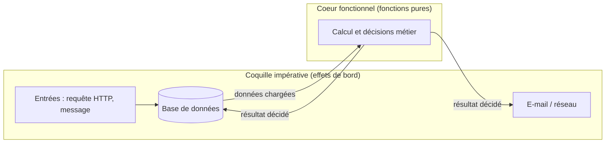

[← Fonctions et duplication](03-fonctions-et-duplication.md) · [↑ Sommaire](../README.md#table-des-matières) · [Tests et documentation →](05-tests-et-documentation.md)

# 4. Conception orientée objet

## Objets vs structures de données

Robert C. Martin oppose deux styles de modélisation que beaucoup confondent :

> **Que veut dire « DTO » ?** *DTO* signifie *Data Transfer Object* (« objet de transfert de données »). C'est un objet tout simple, sans aucune logique, dont le seul rôle est de transporter des données d'un endroit à un autre (par exemple du formulaire web jusqu'au cœur de l'application). Comparez-le à une enveloppe : elle contient le courrier, mais elle ne le lit pas et ne décide rien.

> **Que veut dire « persistance » et « sérialisation » ?** *Persister* une donnée, c'est l'enregistrer durablement quelque part (le plus souvent en base de données) pour la retrouver après l'extinction du programme. *Sérialiser*, c'est transformer un objet en une suite de caractères transportable (par exemple du texte JSON) pour l'envoyer sur le réseau ou l'écrire dans un fichier ; *désérialiser* fait l'opération inverse. Analogie : sérialiser, c'est démonter un meuble à plat pour l'expédier ; désérialiser, c'est le remonter à l'arrivée.

| | Structure de données | Objet |
|--|----------------------|-------|
| Expose | ses **données** ; l'extérieur écrit la logique. | son **comportement** ; les données sont cachées. |
| Idéal pour | DTO, transport, persistance, sérialisation. | Domaine métier, règles, invariants. |
| Test du *bon style* | Ajouter un nouveau **type** est facile (une nouvelle structure suffit). | Ajouter une nouvelle **opération** est facile (une nouvelle méthode sur l'interface suffit). |

```php
// Structure de données : transparente, sans logique
final class CoordonneesDto
{
    public function __construct(
        public readonly float $latitude,
        public readonly float $longitude,
    ) {}
}

// Objet : logique encapsulée, données cachées
final class Position
{
    public function __construct(private float $latitude, private float $longitude) {}

    public function distanceA(self $autre): float { /* ... */ }
    public function estDansRayon(self $centre, float $rayonKm): bool { /* ... */ }
}
```

> **Que veut dire « Active Record » et « Repository » ?** Ce sont deux façons d'organiser l'accès à la base de données. Avec le motif *Active Record*, l'objet métier sait lui-même se sauvegarder (`$commande->save()`) : il mélange les données du métier et l'accès à la base. Avec le motif *Repository* (« dépôt »), un objet séparé s'occupe d'aller chercher et d'enregistrer les données (`$repository->enregistrer($commande)`), laissant l'objet métier se concentrer sur ses règles. Analogie : l'Active Record est un employé qui range lui-même ses dossiers ; le Repository est un archiviste dédié à qui on confie le rangement.

Le piège classique : un *Active Record* qui est mi-DTO, mi-objet métier, il cumule les inconvénients des deux. Mieux vaut séparer la couche persistance (DTO/Repository) du domaine (objet riche).

[🔝 Retour en haut de page](#table-des-matières)

## Loi de Déméter et Tell, Don't Ask

### Loi de Déméter (LoD)

> **Que veut dire « loi de Déméter » (LoD) ?** *LoD* abrège *Law of Demeter* (du nom d'un projet de recherche). C'est une règle de bon voisinage entre objets : **ne parlez qu'à vos amis directs, jamais aux amis de vos amis**. Dans la vie, pour emprunter un outil à votre voisin, vous le lui demandez à lui ; vous n'allez pas fouiller dans le garage du voisin de votre voisin. En code, cela évite les longues chaînes du genre `a.b.c.d` qui supposent de connaître l'intérieur de chaque objet traversé.

Énoncée à la Northeastern University en 1987, la loi tient en une phrase : **un objet ne devrait parler qu'à ses amis directs**, pas aux amis de ses amis.

Concrètement, à l'intérieur d'une méthode de la classe `A`, on ne peut appeler que :

1. les méthodes de `A` lui-même,
2. les méthodes des objets passés en argument,
3. les méthodes des attributs directs de `A`,
4. les méthodes des objets que `A` crée elle-même.

```php
// À éviter : "train wreck", chaîne d'appels qui révèle la structure interne
$prix = $commande->getClient()->getAdresse()->getPays()->getTauxTva();

// À préférer : on demande directement ce dont on a besoin
$prix = $commande->tauxTvaApplicable();
```

> **Que veut dire « train wreck » ?** Littéralement « accident de train ». C'est le surnom d'une longue chaîne d'appels enchaînés comme `$commande->getClient()->getAdresse()->getPays()->getTauxTva()`. Les appels s'alignent comme des wagons, et si un seul maillon de la chaîne change (par exemple le pays n'a plus de taux de TVA direct), tout déraille. On préfère demander en une fois ce dont on a besoin.

> **Que veut dire « appelant » ?** L'*appelant* est le morceau de code qui utilise (qui « appelle ») une fonction ou une méthode. Si la fonction `B` est appelée depuis la fonction `A`, alors `A` est l'appelant de `B`. Garder une fonction stable « sans casser l'appelant » signifie que tous les codes qui s'en servaient continuent de marcher.

Le second extrait permet de changer la structure interne (par exemple : la TVA dépend désormais de la catégorie du produit) sans casser l'appelant.

### Tell, Don't Ask

> **Que veut dire « Tell, Don't Ask » ?** « Dis, ne demande pas. » Plutôt que de soutirer les données d'un objet pour décider à sa place à l'extérieur (lui *demander* son solde puis calculer), on lui *dit* directement quoi faire (`$compte->debiter($montant)`) et on le laisse appliquer ses propres règles. Analogie : au restaurant, vous dites au cuisinier « un steak à point » ; vous n'entrez pas en cuisine retourner la viande vous-même.

Plutôt que d'**interroger** un objet pour prendre une décision à sa place, on lui **dit** quoi faire.

```php
// Ask : on extrait l'état, on décide à l'extérieur
if ($compte->getSolde() >= $montant) {
    $compte->setSolde($compte->getSolde() - $montant);
} else {
    throw new SoldeInsuffisant();
}

// Tell : la règle vit là où vivent les données
$compte->debiter($montant); // lance SoldeInsuffisant si nécessaire
```

> **Que veut dire « encapsulation » ?** L'*encapsulation* consiste à cacher l'état interne d'un objet derrière des méthodes qui contrôlent son accès. Au lieu de laisser n'importe qui modifier directement le solde d'un compte, on oblige à passer par `debiter()` et `crediter()`, qui vérifient les règles. Analogie : un distributeur de billets ne vous laisse pas plonger la main dans le coffre ; il vous oblige à passer par des boutons qui appliquent les contrôles.

Le second style respecte l'**encapsulation** : l'invariant « solde non négatif » ne peut plus être violé par un appelant distrait.

[🔝 Retour en haut de page](#table-des-matières)

## Fonctions pures et effets de bord

> **Que veut dire « effet de bord » ?** Un *effet de bord* (en anglais *side effect*) est tout ce qu'une fonction fait en plus de calculer et renvoyer sa réponse : écrire dans un fichier, modifier une donnée partagée, envoyer un e-mail, afficher quelque chose. Analogie : demander l'heure à quelqu'un devrait juste vous donner l'heure ; si en plus la personne repeint votre salon, c'est un effet de bord, et ça complique tout.

> **Que veut dire « fonction pure » ?** Une *fonction pure* est une fonction sans effet de bord dont la réponse ne dépend que de ses arguments : mêmes entrées, toujours même sortie. C'est comme une calculatrice : `2 + 3` donne toujours `5`, sans rien changer dans le monde. Ces fonctions sont les plus faciles à tester et à raisonner, car il n'y a aucune surprise cachée.

Une **fonction pure** :

1. **renvoie toujours le même résultat** pour les mêmes arguments ;
2. **n'a aucun effet de bord** : pas d'écriture en base, en fichier, en réseau, dans une variable globale, dans un attribut.

> **Que veut dire « mock » et « fixture » ?** Dans les tests, un *mock* (« objet factice ») est une fausse version d'une dépendance, fabriquée pour le test : par exemple un faux service d'envoi d'e-mail qui se contente de noter qu'on l'a appelé, sans rien envoyer. Une *fixture* est un jeu de données préparé à l'avance pour mettre le test dans un état connu (par exemple « trois clients déjà en base »). Les deux servent à isoler le code testé, mais ils alourdissent les tests : une fonction pure n'en a pas besoin, ce qui la rend bien plus simple à vérifier.

Les fonctions pures sont triviales à tester : pas de mock, pas de fixture, pas de nettoyage.

```php
// Fonction pure : entrées => sortie, point.
function appliquerRemise(Montant $total, float $taux): Montant
{
    return $total->multiplier(1 - $taux);
}

// Impure : journalise, lit l'horloge, écrit en BDD
function appliquerRemiseEtJournaliser(Commande $c, float $taux): Montant
{
    $remise = $c->total()->multiplier(1 - $taux);
    $this->logger->info('Remise appliquée', ['date' => new DateTime()]);
    $this->pdo->prepare('UPDATE ...')->execute([...]);
    return $remise;
}
```

### Stratégie : *functional core, imperative shell*

> **Que veut dire « functional core, imperative shell » ?** Littéralement « cœur fonctionnel, coquille impérative ». L'idée : mettre tous les calculs et décisions du métier dans des fonctions pures (le **cœur**, facile à tester car sans contact avec le monde extérieur), et regrouper tout ce qui touche au monde réel (lire la base de données, envoyer un e-mail) dans une fine **coquille** autour. Analogie : un noyau de fruit dur et stable au centre, entouré d'une chair tendre qui interagit avec l'extérieur.

L'idéal pratique est de :

* **concentrer la logique métier dans des fonctions pures** (testables, raisonnables) ;
* **reléguer les effets de bord à une fine couche extérieure** (contrôleur, *use case*) qui orchestre.



Le cœur ne connaît ni la base ni le réseau : on lui donne des données, il renvoie un résultat. C'est la coquille qui se charge d'aller chercher ces données puis d'appliquer le résultat.

```php
// Cœur pur : décide
final class CalculateurFacture
{
    public function calculer(Panier $panier, Client $client): Facture { /* aucun I/O */ }
}

// Coquille imperative : agit
final class ValiderCommandeUseCase
{
    public function executer(NouvelleCommande $payload): void
    {
        $panier   = $this->paniers->charger($payload->panierId);   // I/O
        $client   = $this->clients->charger($payload->clientId);   // I/O
        $facture  = $this->calculateur->calculer($panier, $client); // pur
        $this->factures->enregistrer($facture);                    // I/O
        $this->mailer->envoyer($client->email, $facture);          // I/O
    }
}
```

[🔝 Retour en haut de page](#table-des-matières)

---

[← Fonctions et duplication](03-fonctions-et-duplication.md) · [↑ Sommaire](../README.md#table-des-matières) · [Tests et documentation →](05-tests-et-documentation.md)
