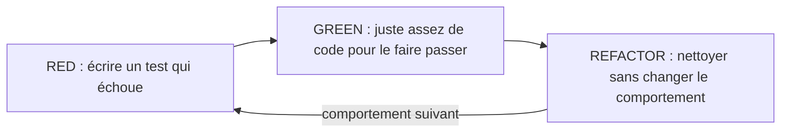

[← Conception orientée objet](04-conception-orientee-objet.md) · [↑ Sommaire](../README.md#table-des-matières) · [Erreurs, structure et dépendances →](06-erreurs-structure-et-dependances.md)

# 5. Tests et documentation

## Utilisation de tests unitaires

> **Que veut dire « test unitaire » ?** Un *test unitaire* est un petit programme qui vérifie automatiquement qu'un morceau de code (une « unité », souvent une fonction ou une classe) se comporte comme prévu. Il appelle le code avec des entrées connues et vérifie que la sortie est la bonne. Analogie : avant de monter un meuble, on teste chaque vis et chaque planche séparément ; si une pièce est défectueuse, on le sait tout de suite, sans attendre que le meuble s'effondre.

> **Que veut dire « spécification exécutable » ?** Un bon test décrit ce que le code *doit* faire, comme un cahier des charges, mais sous une forme que la machine peut vérifier toute seule. Là où un document écrit se périme en silence, un test qui ne correspond plus au code passe au rouge et alerte. C'est donc une description du comportement attendu qui ne peut pas mentir.

Un test unitaire vérifie le comportement d'une unité de code (typiquement une classe ou une fonction) isolée de ses dépendances. Il sert de filet de sécurité pour le refactoring et de spécification exécutable.

### Bonnes pratiques

| Pratique | Description |
|----------|-------------|
| Un test = un comportement | Le nom du test décrit ce qui est vérifié (`it_renvoie_null_quand_id_inconnu`). |
| Patron AAA | *Arrange* (préparer), *Act* (exécuter), *Assert* (vérifier). |
| Indépendance | Les tests s'exécutent dans n'importe quel ordre, sans état partagé. |
| Rapidité | Un test unitaire dure quelques millisecondes ; les tests lents découragent leur exécution. |

> **Que veut dire le patron « AAA » et le mot « assertion » ?** *AAA* découpe un test en trois temps : *Arrange* (préparer la situation et les données), *Act* (exécuter l'action à tester), *Assert* (vérifier que le résultat est bien celui attendu). Une *assertion* est justement cette vérification automatique : une ligne du type « j'affirme que le résultat vaut 5 ». Si l'affirmation est fausse, le test échoue. Pensez à une recette : préparer les ingrédients, cuire, puis goûter pour confirmer.
| Test d'erreurs | Vérifier les chemins d'échec autant que les chemins nominaux. |

### Exemple

```php
use PHPUnit\Framework\TestCase;

final class CalculatriceTest extends TestCase
{
    public function test_addition_de_deux_entiers(): void
    {
        $calc = new Calculatrice();

        $resultat = $calc->ajouter(2, 3);

        $this->assertSame(5, $resultat);
    }
}
```

### Frameworks usuels

[PHPUnit](https://phpunit.de/) en PHP, [JUnit](https://junit.org/) en Java, [pytest](https://pytest.org/) en Python, [Jest](https://jestjs.io/) en JavaScript, [xUnit](https://xunit.net/) en .NET.

### Quand ne pas écrire de tests unitaires

> **Que veut dire « ORM » et « tests d'intégration » ?** Un *ORM* (*Object-Relational Mapping*, « correspondance objet-relationnel ») est un outil qui traduit automatiquement entre les objets du code et les lignes d'une base de données, pour éviter d'écrire les requêtes à la main. Les *tests d'intégration*, eux, vérifient que plusieurs morceaux fonctionnent **ensemble** (par exemple le code et la vraie base de données), là où le test unitaire vérifie un morceau isolé. Analogie : tester chaque pièce d'une voiture, c'est l'unitaire ; démarrer le moteur monté pour voir si tout s'emboîte, c'est l'intégration.

Le code purement déclaratif (configuration, *mapping* ORM) gagne peu à être unitairement testé. À l'inverse, du code algorithmique simple n'a pas toujours besoin d'une couverture exhaustive ; les tests d'intégration peuvent suffire.

[🔝 Retour en haut de page](#table-des-matières)

## Tests : principes F.I.R.S.T. et TDD

### F.I.R.S.T.

> **Que veut dire « F.I.R.S.T. » ?** C'est un acronyme (un mot formé des initiales de plusieurs mots) qui résume cinq qualités d'un bon test unitaire : *Fast* (rapide), *Independent* (indépendant), *Repeatable* (reproductible), *Self-validating* (auto-validant) et *Timely* (écrit au bon moment). Le tableau ci-dessous détaille chacune. Le mot anglais *first* signifie « d'abord », clin d'œil au fait qu'on écrit idéalement le test avant le code.

> **Que veut dire « I/O » ?** *I/O* abrège *Input/Output* (« entrées/sorties »). Ce sont tous les échanges entre le programme et le monde extérieur : lire un fichier, interroger une base de données, appeler le réseau. Ces opérations sont lentes et imprévisibles, d'où la consigne de les éviter dans les tests unitaires en les remplaçant par des doubles (de faux objets, voir l'encadré sur les *mocks*).

Acronyme proposé par Robert C. Martin pour caractériser un bon test unitaire :

| Lettre | Mot | Signification | Conséquence pratique |
|--------|-----|---------------|----------------------|
| **F** | **Fast** (rapide) | Le test s'exécute en quelques millisecondes. | Pas de réseau, pas de base réelle, pas de `sleep()`. Doubles de tests pour les I/O. |
| **I** | **Independent** (indépendant) | Aucun test ne dépend du résultat d'un autre, ni de leur ordre. | Pas d'état partagé, pas de fixture globale mutable. |
| **R** | **Repeatable** (reproductible) | Le test donne le même résultat à chaque exécution, sur n'importe quelle machine. | Geler l'horloge (*clock injection*), figer les générateurs aléatoires. |
| **S** | **Self-validating** (auto-validant) | Le test renvoie *vert* ou *rouge* sans interprétation humaine. | Pas de `var_dump`, pas d'inspection visuelle. Des assertions, point. |
| **T** | **Timely** (à temps) | Le test est écrit **juste avant** ou **avec** le code de production, pas après coup. | Sinon le code se fige en formes difficiles à tester (statiques, singletons, longues fonctions). |

#### Exemple commenté

```php
final class CalculateurRemiseTest extends TestCase
{
    public function test_pas_de_remise_sous_le_seuil(): void
    {
        // Arrange : données figées, pas d'I/O => Fast, Repeatable
        $calc = new CalculateurRemise(seuil: 100, taux: 0.10);

        // Act
        $remise = $calc->pour(montant: 50);

        // Assert : auto-validant, sans var_dump
        $this->assertSame(0.0, $remise);
    }

    public function test_remise_de_dix_pourcent_au_dessus_du_seuil(): void
    {
        $calc = new CalculateurRemise(seuil: 100, taux: 0.10);

        $remise = $calc->pour(montant: 200);

        $this->assertSame(20.0, $remise);
    }
}
```

Ces deux tests sont **indépendants** (chacun crée son propre objet), **rapides** (aucune I/O), **reproductibles** (aucune horloge ni aléa), **auto-validants** (assertions strictes).

### TDD : Red, Green, Refactor

> **Que veut dire « TDD » ?** *TDD* signifie *Test-Driven Development* (« développement piloté par les tests »). Au lieu d'écrire le code puis (peut-être) un test, on écrit le test **d'abord**, puis juste assez de code pour le satisfaire. Les couleurs viennent de l'outil de test : rouge quand le test échoue, vert quand il passe. Analogie : on dessine d'abord le contour de la pièce manquante d'un puzzle (le test), puis on fabrique la pièce qui rentre exactement dedans (le code).

Le *Test-Driven Development* (Kent Beck, 2003) est une discipline en boucle courte :

1. **Red** (rouge) : écrire un test qui échoue parce que le comportement n'existe pas encore. Lancer le test : il doit être rouge.
2. **Green** (vert) : écrire **le code minimum** qui fait passer le test au vert. Pas plus. Même si c'est moche.
3. **Refactor** (réorganiser) : le test étant vert, améliorer la structure (extraire, renommer, dédupliquer) **sans changer le comportement**. Relancer les tests : ils restent verts.
4. Recommencer pour le comportement suivant.



Bénéfices : on n'écrit que du code couvert, la conception émerge progressivement, et chaque refactoring est protégé par un filet.

#### Mini-cycle TDD en PHP

```php
// 1. RED : j'écris le test avant que la classe n'existe.
public function test_total_panier_vide_vaut_zero(): void
{
    $panier = new Panier();
    $this->assertSame(0, $panier->total());
}
// (Le test échoue : la classe Panier n'existe pas encore.)

// 2. GREEN : je fais passer, même grossièrement.
final class Panier
{
    public function total(): int { return 0; }
}

// 3. RED suivant
public function test_total_avec_un_article(): void
{
    $panier = new Panier();
    $panier->ajouter(new Article(prixCentimes: 250));

    $this->assertSame(250, $panier->total());
}

// 4. GREEN minimal
final class Panier
{
    /** @var Article[] */
    private array $articles = [];

    public function ajouter(Article $a): void { $this->articles[] = $a; }
    public function total(): int
    {
        $somme = 0;
        foreach ($this->articles as $a) { $somme += $a->prixCentimes(); }
        return $somme;
    }
}

// 5. REFACTOR sans changer le comportement
public function total(): int
{
    return array_sum(array_map(fn(Article $a) => $a->prixCentimes(), $this->articles));
}
```

### TDD n'est pas obligatoirement *test-first*

La présentation classique de TDD impose le test **avant** le code. C'est efficace pour explorer une API depuis le point de vue de l'utilisateur, et pour cadrer une fonctionnalité encore floue. Mais Kent Beck lui-même a depuis nuancé son propos : la valeur de TDD est dans la **boucle courte de feedback**, pas dans l'ordre des frappes au clavier.

| Approche | Quand l'employer | Limites |
|----------|------------------|---------|
| **Test-first strict** | Comportement nouveau, API à concevoir, bug à reproduire avant correction. | Inutilement lourd pour une exploration ou un *spike* jetable. |
| **Test-after immédiat** | Code écrit en mode exploratoire (REPL, prototype), figé en production via tests rétroactifs **avant** le commit. | Risque d'écrire des tests qui ne testent que ce que le code fait déjà : penser à *tester l'intention*. |
| **Test-after de refactoring** | Avant de refactorer une zone non couverte : on **caractérise** d'abord avec des *characterization tests* (Michael Feathers, *Working Effectively with Legacy Code*), puis on refactore. | Les tests de caractérisation gèlent le comportement actuel, bugs compris. À nettoyer dans un second temps. |
| **Aucun test** | Script de migration unique, *one-shot* d'analyse, code de présentation. | Ne pas se mentir : si le script tourne deux fois, il vit, et il finira en prod sans test. |

> **Que veut dire « REPL », « spike », « characterization test » ?** Un *REPL* (*Read-Eval-Print Loop*, « lire-évaluer-afficher en boucle ») est une console interactive où l'on tape une ligne de code et voit le résultat aussitôt, idéale pour bricoler. Un *spike* (« pointe ») est un bout de code écrit vite pour répondre à une question (« est-ce faisable ? »), destiné à être jeté. Un *characterization test* (« test de caractérisation ») est un test écrit après coup sur du code existant non testé : il fige le comportement actuel, tel quel, pour pouvoir le réorganiser sans rien casser. Pensez à photographier une pièce avant de la repeindre, afin de pouvoir comparer ensuite.

> **Que veut dire « commit » et « prod » ?** Un *commit* est un enregistrement daté d'un ensemble de modifications dans l'historique du code (avec un outil comme Git) : une sorte de point de sauvegarde nommé. *Prod*, abréviation de *production*, désigne l'environnement réel où tourne le logiciel utilisé par les vrais utilisateurs, par opposition à la machine du développeur. « Finir en prod » signifie « se retrouver entre les mains des utilisateurs ».

L'important n'est pas la chronologie mais la **discipline du filet** : aucune modification ne traverse la frontière sans que **quelque chose** vérifie qu'elle ne casse rien. Test-first amène cette discipline plus naturellement, mais ce n'est pas la seule voie.

### Test smells (mauvaises odeurs côté tests)

| Smell | Symptôme | Remède |
|-------|----------|--------|
| Test fragile | Un changement interne casse le test sans changer le comportement public. | Tester via l'API publique, pas l'implémentation. |
| Test obscur | Beaucoup de mise en place avant la moindre assertion. | Extraire des *builders* ou *factories* de tests. |
| Tests interdépendants | Un test ne passe que si un autre est exécuté avant. | Repartir d'un état neuf à chaque test. |
| Assertion molle | Le test passe pour un trop large éventail de comportements. | Assertions précises (`assertSame` plutôt qu'`assertNotNull`). |
| Mocking excessif | Le test est presque entièrement constitué de doubles. | Souvent le signe d'un couplage trop fort à corriger côté production. |

[🔝 Retour en haut de page](#table-des-matières)

## Documentation de code

La documentation utile est celle qui survit aux refactorings : elle décrit *l'intention*, pas l'implémentation. Trois niveaux complémentaires :

> **Que veut dire « README », « ADR », « OpenAPI » ?** Un *README* (« lis-moi ») est le fichier d'accueil d'un projet : à quoi il sert, comment l'installer, comment démarrer. Un *ADR* (*Architecture Decision Record*, « fiche de décision d'architecture ») est une note courte qui consigne une décision importante et **pourquoi** elle a été prise, pour que les successeurs comprennent le raisonnement. *OpenAPI* est un format standard pour décrire les points d'entrée d'une API web (les adresses à appeler, ce qu'elles attendent et renvoient), souvent généré automatiquement. Le mot *implémentation* désigne simplement le détail concret de comment le code est écrit à l'intérieur.

| Niveau | Public | Exemples |
|--------|--------|----------|
| README | Nouveaux contributeurs | But du projet, prérequis, démarrage. |
| Architecture (ADR) | Mainteneurs | Décisions structurantes et leurs justifications. |
| API (PHPDoc, OpenAPI) | Consommateurs du code | Signatures, contrats, codes d'erreur. |

### À éviter

```php
/**
 * Cette méthode prend un id et retourne un utilisateur.
 *
 * @param int $id l'id
 * @return User l'utilisateur
 */
public function find(int $id): User { ... }
```

Le commentaire paraphrase la signature sans rien ajouter.

### À préférer

```php
/**
 * Récupère un utilisateur par son identifiant interne.
 *
 * @throws UtilisateurIntrouvable si aucun utilisateur ne porte cet identifiant.
 */
public function find(int $id): User { ... }
```

[🔝 Retour en haut de page](#table-des-matières)

---

[← Conception orientée objet](04-conception-orientee-objet.md) · [↑ Sommaire](../README.md#table-des-matières) · [Erreurs, structure et dépendances →](06-erreurs-structure-et-dependances.md)
