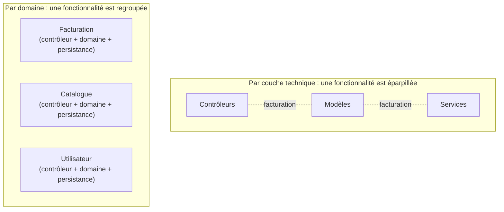

[← Tests et documentation](05-tests-et-documentation.md) · [↑ Sommaire](../README.md#table-des-matières) · [Détecter et refactorer →](07-detecter-et-refactorer.md)

# 6. Erreurs, structure et dépendances

## Gestion des erreurs et des exceptions

> **Que veut dire « exception » ?** Une *exception* est un signal d'alarme qu'un morceau de code lance (en anglais *throw*, « jeter ») quand il rencontre un problème qu'il ne peut pas résoudre seul, par exemple « base de données injoignable ». Ce signal remonte automatiquement jusqu'à un endroit capable de réagir, qui le « rattrape » (*catch*). Analogie : un employé qui ne peut pas traiter un dossier ne le jette pas à la poubelle en silence ; il fait remonter le problème à son responsable, qui décide quoi faire.

> **Que veut dire « journaliser » (un log) ?** *Journaliser* (en anglais *log*), c'est écrire des messages dans un fichier d'historique pour garder une trace de ce qui se passe dans le programme : erreurs, événements importants, contexte. Quand un bug survient en production, ce journal est souvent la seule fenêtre sur ce qui s'est réellement produit, comme la boîte noire d'un avion.

Une erreur est un événement exceptionnel qui empêche une opération d'aboutir. Le code doit la signaler clairement, l'attraper là où on peut décider quoi en faire, et fournir au journal de quoi diagnostiquer.

### À éviter

```php
$resultat = mysqli_connect(...);
if (!$resultat) {
    die('Erreur : connexion impossible');
}
```

`die()` et `exit()` interrompent l'exécution sans laisser à l'appelant la moindre chance de réagir, et ne produisent aucune trace exploitable.

### À préférer

```php
try {
    $connexion = new PDO($dsn, $user, $password);
} catch (PDOException $e) {
    $logger->error('Connexion BDD impossible', ['exception' => $e]);
    throw new ServiceIndisponible('Base de données injoignable', previous: $e);
}
```

| Pratique | Pourquoi |
|----------|----------|
| Exceptions plutôt que codes de retour | L'oubli d'un code d'erreur est silencieux ; une exception non gérée explose. |
| Types d'exceptions métier | `UtilisateurIntrouvable` est plus clair que `Exception('not found')`. |
| Capturer le plus tard possible | Là où l'on peut vraiment décider : afficher un message, retenter, basculer. |
| Conserver la cause (`previous:`) | Préserve la chaîne complète pour le débogage. |
| Journaliser avec contexte | Identifiant utilisateur, identifiant de requête, et non l'objet brut. |

### Quand ne pas lancer d'exception

Une absence de résultat *attendue* (recherche qui ne trouve rien) n'est pas une erreur ; renvoyer `null` ou un type optionnel est plus honnête.

[🔝 Retour en haut de page](#table-des-matières)

## Structure du code claire et organisée

> **Que veut dire « domaine » et « couche technique » ?** Le *domaine* (ou domaine métier), c'est le sujet réel que traite le logiciel : pour une boutique, ce sont les commandes, les factures, le catalogue. Une *couche technique*, c'est un rôle dans la mécanique du code (les contrôleurs, les services, l'accès base). Organiser **par domaine**, c'est ranger ensemble tout ce qui concerne la facturation ; organiser **par couche**, c'est ranger ensemble tous les contrôleurs, puis tous les services. Analogie : dans une bibliothèque, ranger par thème (cuisine, voyage) plutôt que par type d'objet (toutes les couvertures rouges ensemble).

Un projet bien structuré laisse deviner où ajouter une fonctionnalité avant même de l'avoir lue. Cela suppose une organisation **par domaine** plutôt que par couche technique.

### À éviter

```
src/
├── controllers/
├── models/
├── services/
└── helpers/
```

Cette organisation par couche force à parcourir tout le projet pour comprendre une fonctionnalité.

### À préférer

```
src/
├── Facturation/
│   ├── Controleur/
│   ├── Domaine/
│   └── Persistance/
├── Catalogue/
│   ├── Controleur/
│   ├── Domaine/
│   └── Persistance/
└── Utilisateur/
    ├── Controleur/
    ├── Domaine/
    └── Persistance/
```

Chaque module reste autonome : on peut le lire sans connaître les autres, et le déplacer ou l'extraire en service à part sans démêler des dépendances cachées.



Dans le schéma du haut, comprendre la facturation oblige à sauter de dossier en dossier ; dans celui du bas, tout tient au même endroit.

[🔝 Retour en haut de page](#table-des-matières)

## Gestion des dépendances

> **Que veut dire « dépendance » et « bibliothèque » ?** Une *dépendance* est un bout de code écrit par d'autres que votre programme réutilise au lieu de le réécrire (par exemple un outil tout fait pour envoyer des e-mails). Une *bibliothèque* (en anglais *library*) est justement un tel ensemble de fonctions prêtes à l'emploi. L'avantage : on gagne du temps. Le coût : il faut suivre ses mises à jour et ses failles, comme un appareil qu'on n'a pas fabriqué soi-même mais qu'on doit entretenir.

Une dépendance externe (bibliothèque, framework) est du code que vous ne maintenez pas mais que vous embarquez. Le coût se paie à la mise à jour, à la sécurité et à la compatibilité.

### Bonnes pratiques

> **Que veut dire « Composer », « SemVer », « CVE » ?** *Composer* est l'outil standard qui télécharge et organise les dépendances d'un projet PHP. *SemVer* (*Semantic Versioning*, « versionnage sémantique ») est une convention de numéros de version en trois parties, `MAJEUR.MINEUR.CORRECTIF` (par exemple `2.3.1`) : on augmente le dernier pour un correctif, celui du milieu pour une nouveauté compatible, et le premier pour un changement qui **casse** l'existant. Une *CVE* (*Common Vulnerabilities and Exposures*) est une faille de sécurité connue et répertoriée publiquement, avec un identifiant unique.

> **Que veut dire « résolution transitive » et « autoload » ?** Une dépendance peut elle-même dépendre d'autres dépendances ; la *résolution transitive* est le travail de l'outil qui démêle toute cette chaîne (les amis de vos amis) et installe le bon ensemble. L'*autoload* (« chargement automatique ») est le mécanisme qui charge le bon fichier au moment où on utilise une classe, sans avoir à l'inclure à la main.

| Pratique | Pourquoi |
|----------|----------|
| Utiliser un gestionnaire ([Composer](https://getcomposer.org/)) | Versions reproductibles, résolution transitive, autoload. |
| Verrouiller les versions (`composer.lock`) | Garantit que CI, devs et prod installent le même graphe. |
| Suivre [SemVer](https://semver.org/) | `^1.2.3` accepte les correctifs et fonctionnalités, pas les ruptures. |
| Auditer régulièrement (`composer audit`) | Détecte les CVE connues. |
| Limiter les dépendances optionnelles | Chaque dépendance ajoute une surface d'attaque et un risque de conflit. |

> **Que veut dire « CI » ?** *CI* signifie *Continuous Integration* (« intégration continue »). C'est un service automatique qui, à chaque modification envoyée, récupère le code et lance tout seul les vérifications (tests, contrôles de style) pour signaler immédiatement ce qui casse. Analogie : un contrôle qualité en bout de chaîne qui inspecte chaque pièce avant qu'elle n'aille plus loin.

### À éviter

```json
{
  "require": {
    "vendor/lib": "*"
  }
}
```

> **Que veut dire « JSON » ?** *JSON* (*JavaScript Object Notation*) est un format texte simple pour écrire des données structurées sous forme de paires « clé : valeur », lisible aussi bien par l'humain que par la machine. Le fichier `composer.json` ci-dessus, par exemple, liste les dépendances du projet dans ce format.

`*` accepte la prochaine version majeure et son lot de ruptures.

### À préférer

```json
{
  "require": {
    "vendor/lib": "^2.3"
  }
}
```

[🔝 Retour en haut de page](#table-des-matières)

## Gestion de la complexité du code

> **Que veut dire « complexité cyclomatique » ?** C'est une mesure chiffrée du nombre de chemins différents qu'un programme peut emprunter dans une fonction. Chaque `if`, chaque boucle, chaque branche ajoute un chemin possible. Plus il y en a, plus il faut de tests pour tout couvrir et plus la fonction est dure à suivre. Analogie : un labyrinthe à une seule allée se parcourt sans réfléchir ; avec dix embranchements, il faut une carte.

> **Que veut dire « clause de garde » ?** Une *clause de garde* (*guard clause*) est un `if` placé tout en haut d'une fonction qui traite immédiatement un cas particulier et sort (avec `return` ou en levant une exception). Cela évite d'imbriquer le code dans des `if` en cascade : on écarte d'abord les cas anormaux, puis le cas normal s'écrit à plat. Analogie : le videur à l'entrée renvoie tout de suite ceux qui n'ont pas le bon billet, et l'intérieur reste réservé aux gens en règle.

La complexité cyclomatique mesure le nombre de chemins d'exécution distincts dans une fonction. Au-delà de 10, la fonction devient difficile à tester exhaustivement et à comprendre.

### À éviter : imbrication excessive

```php
function inscrire(array $data) {
    if (!empty($data['email'])) {
        if (filter_var($data['email'], FILTER_VALIDATE_EMAIL)) {
            if (!empty($data['mdp'])) {
                if (strlen($data['mdp']) >= 8) {
                    // ... la vraie logique, perdue à 4 niveaux d'indentation
                }
            }
        }
    }
}
```

### À préférer : clauses de garde

```php
function inscrire(array $data) {
    if (empty($data['email']) || !filter_var($data['email'], FILTER_VALIDATE_EMAIL)) {
        throw new DonneesInvalides('email');
    }
    if (empty($data['mdp']) || strlen($data['mdp']) < 8) {
        throw new DonneesInvalides('mdp');
    }

    // logique réelle au premier niveau d'indentation
}
```

> **Que veut dire « polymorphisme » et « table de dispatch » ?** Le *polymorphisme* (du grec « plusieurs formes ») permet à plusieurs types d'objets de répondre au même appel, chacun à sa façon : on demande `commission()` à un objet employé sans savoir s'il est en CDI ou stagiaire, et chacun calcule la sienne. Cela remplace les longues cascades de `if` testant le type. Une *table de dispatch* (« table d'aiguillage ») est une variante plus simple : une correspondance qui associe directement une valeur à l'action à exécuter, comme un standard téléphonique qui dirige chaque numéro vers le bon poste.

| Symptôme | Remède |
|----------|--------|
| `if`/`else` profondément imbriqués | Clauses de garde (`return`/`throw` tôt). |
| Longue chaîne `else if` | Table de dispatch, polymorphisme, ou `match`. |
| Conditions booléennes longues | Extraire dans une fonction au nom signifiant : `estEligible(...)`. |

[🔝 Retour en haut de page](#table-des-matières)

## Les fonctions doivent faire une seule chose

> **Que veut dire « principe de responsabilité unique » (SRP) ?** *SRP* abrège *Single Responsibility Principle*. L'idée : une fonction (ou une classe) ne doit avoir qu'**une seule raison de changer**, donc s'occuper d'une seule chose. Une fonction qui se connecte à la base, calcule, met en forme et envoie un e-mail changera pour quatre raisons différentes ; chaque évolution risque de casser les autres. Analogie : un couteau suisse qui fait tout fait chaque tâche moins bien et casse pour tout le monde quand une seule lame se brise.

C'est le principe de responsabilité unique appliqué au niveau d'une fonction. Si vous pouvez décrire le rôle d'une fonction sans utiliser « et » ou « puis », elle est probablement bien découpée.

### À éviter

```php
function getUtilisateur(int $id): ?array {
    $cnx = mysqli_connect('localhost', 'user', 'pwd', 'db');
    $sql = "SELECT * FROM users WHERE id = $id";
    $res = mysqli_query($cnx, $sql);
    $row = mysqli_fetch_assoc($res);
    mysqli_close($cnx);
    return $row;
}
```

Cette fonction connecte, exécute, hydrate et nettoie ; quatre raisons de changer (driver, schéma, format de retour, gestion de connexion).

### À préférer

```php
final class UtilisateurRepository
{
    public function __construct(private PDO $pdo) {}

    public function trouverParId(int $id): ?Utilisateur
    {
        $stmt = $this->pdo->prepare('SELECT * FROM users WHERE id = :id');
        $stmt->execute(['id' => $id]);
        $row = $stmt->fetch(PDO::FETCH_ASSOC);

        return $row ? Utilisateur::depuisLigne($row) : null;
    }
}
```

> **Que veut dire « injectée » (injection de dépendance) et « hydratation » ?** *Injecter* une dépendance, c'est fournir à un objet, depuis l'extérieur, les outils dont il a besoin (ici la connexion à la base), au lieu qu'il les fabrique lui-même. Cela rend le code testable, car on peut lui passer un faux outil. Analogie : on branche une lampe sur une prise existante au lieu de lui demander de produire sa propre électricité. L'*hydratation* est l'opération qui remplit un objet à partir de données brutes (une ligne de base de données), comme verser de l'eau sur une éponge déshydratée pour lui redonner sa forme.

### Quand assouplir

> **Que veut dire « parser » ?** *Parser* (« analyser syntaxiquement »), c'est lire un texte brut et le transformer en une structure que le programme comprend : par exemple lire une date écrite `2026-06-27` et en faire un véritable objet date. Un *parser* est le composant qui fait ce travail, comme un traducteur qui convertit une phrase étrangère en sens exploitable.

Une fonction utilitaire d'une dizaine de lignes qui orchestre deux étapes très liées (« lire un fichier puis le parser ») peut rester d'un seul tenant si l'extraction n'apporte aucune réutilisabilité.

[🔝 Retour en haut de page](#table-des-matières)

---

[← Tests et documentation](05-tests-et-documentation.md) · [↑ Sommaire](../README.md#table-des-matières) · [Détecter et refactorer →](07-detecter-et-refactorer.md)
