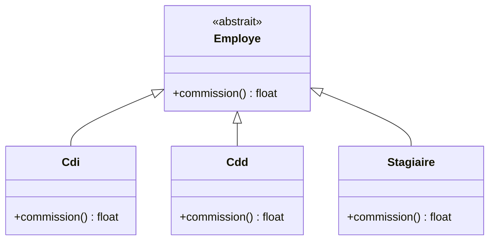

[← Erreurs, structure et dépendances](06-erreurs-structure-et-dependances.md) · [↑ Sommaire](../README.md#table-des-matières) · [Revue de code et outillage →](08-revue-de-code-et-outillage.md)

# 7. Détecter et refactorer

## Code smells (mauvaises odeurs de code)

> **Que veut dire « code smell » et « refactoring » ?** Un *code smell* (« mauvaise odeur de code ») est un signe extérieur qui suggère qu'un bout de code mérite d'être revu : ce n'est pas un bug, juste une alerte, comme une odeur suspecte dans un frigo qui invite à vérifier sans prouver que tout est avarié. Le *refactoring* (« refactorisation ») est l'action de réorganiser le code pour l'améliorer **sans changer ce qu'il fait** : on déplace les meubles d'une pièce, on ne change pas la fonction de la pièce. La table ci-dessous nomme les odeurs les plus courantes et le refactoring qui les soigne.

Un *code smell* est un signal visuel qu'un morceau de code mérite probablement un refactoring. Ce catalogue, popularisé par Martin Fowler et Kent Beck dans *Refactoring*, est un vocabulaire commun pour nommer ce que l'on sent sans toujours savoir formuler.

| Smell (anglais) | Nom français | Symptôme | Refactoring typique |
|------------------|--------------|----------|---------------------|
| **Long method** | Méthode trop longue | La fonction dépasse l'écran ; on perd le fil. | *Extract Method* (extraire des sous-fonctions au nom signifiant). |
| **Large class** | Classe trop grosse | Trop d'attributs, trop de méthodes, plusieurs responsabilités. | *Extract Class* / *Extract Subclass* en respectant la SRP. |
| **Long parameter list** | Liste de paramètres trop longue | Quatre arguments et plus, certains corrélés. | *Introduce Parameter Object*. |
| **Primitive obsession** | Obsession des primitifs | Tout est `string`, `int`, `array`, y compris les concepts métier (email, montant, IBAN). | *Introduce Value Object* (`Email`, `Iban`, `Montant`). |
| **Feature envy** | Envie de fonctionnalité | Une méthode de `A` manipule plus les attributs de `B` que les siens. | *Move Method* vers `B`. |
| **Data clump** | Grumeau de données | Un même groupe de variables apparaît dans plusieurs signatures (`$rue`, `$cp`, `$ville`). | Regrouper dans une classe `Adresse`. |
| **Shotgun surgery** | Modification éparpillée | Un seul changement métier oblige à toucher dix fichiers. | Regrouper la connaissance (*Move Method*, *Inline Class*, module dédié). |
| **Divergent change** | Changement divergent | Le contraire : une seule classe est modifiée pour des raisons indépendantes. | *Extract Class* selon les axes de changement (SRP). |
| **Switch / chain of if** | Cascade de `switch` sur le type | Le même `switch` apparaît à plusieurs endroits. | *Replace Conditional with Polymorphism*. |
| **Speculative generality** | Généralité spéculative | Abstractions ajoutées « au cas où », jamais utilisées. | *Inline Class* / *Inline Method* (YAGNI). |
| **Comments** | Commentaires palliatifs | Les commentaires expliquent ce qu'un meilleur nom dirait. | *Rename* / *Extract Method*. |
| **Dead code** | Code mort | Branches jamais exécutées, méthodes jamais appelées. | Suppression. Git garde l'historique. |
| **Magic number** | Nombre magique | Littéral inscrit dans le code sans nom. | *Replace Magic Number with Symbolic Constant*. |
| **God object** | Objet-Dieu | Une classe « sait tout, fait tout ». | Découper en collaborateurs cohésifs. |
| **Train wreck** | Train d'appels | `$a->b()->c()->d()->e()`. | Demander à l'objet ce qu'on veut (Tell, Don't Ask), respecter la loi de Déméter. |
| **Inappropriate intimacy** | Intimité inappropriée | Deux classes connaissent mutuellement leurs détails internes (attributs `protected` partagés, `friend`, *getters/setters* en cascade). | *Move Method*, *Move Field*, ou inversion de dépendance via interface. |
| **Refused bequest** | Héritage refusé | Une sous-classe hérite d'une superclasse mais désactive ou ignore la moitié de son contrat. | Remplacer l'héritage par la composition (*Replace Inheritance with Delegation*). |
| **Middle man** | Intermédiaire inutile | Une classe ne fait que déléguer chacune de ses méthodes à un attribut. | *Remove Middle Man* : laisser l'appelant accéder directement, ou fusionner. |
| **Temporary field** | Champ temporaire | Un attribut n'a une valeur sensée que pendant une partie du cycle de vie. | *Extract Class* (les champs corrélés vivent ensemble) ou variable locale. |

### Exemple : *Primitive Obsession* en PHP

> **Que veut dire « primitif » et « IBAN » ?** Un type *primitif* est un type de base fourni par le langage : `string` (texte), `int` (nombre entier), `bool` (vrai/faux), `array` (liste). L'*obsession des primitifs* consiste à représenter des concepts métier riches (un e-mail, un montant) par ces types bruts, ce qui oblige à revérifier leur validité partout. Un *IBAN* (*International Bank Account Number*) est le numéro de compte bancaire international ; un simple `string` ne garantit pas qu'il soit valide, alors qu'un type dédié `Iban` le peut.

```php
// À éviter : un email est une string... jusqu'à la prochaine validation oubliée.
function inscrire(string $email, string $motDePasse): void { /* ... */ }

// À préférer : le type rend l'invariant impossible à oublier.
final class Email
{
    public function __construct(private string $valeur)
    {
        if (! filter_var($valeur, FILTER_VALIDATE_EMAIL)) {
            throw new InvalidArgumentException("Email invalide : $valeur");
        }
    }

    public function __toString(): string { return $this->valeur; }
}

function inscrire(Email $email, MotDePasse $motDePasse): void { /* ... */ }
```

Toute fonction qui reçoit un `Email` peut **présupposer** sa validité : la connaissance n'est plus dispersée.

[🔝 Retour en haut de page](#table-des-matières)

## Catalogue de refactorings essentiels

Un refactoring est une transformation **qui ne change pas le comportement**. Tests verts avant, tests verts après. Voici les transformations à connaître par cœur ; le catalogue complet est dans le livre de Martin Fowler.

### Extract Method (extraire une méthode)

```php
// Avant
public function imprimerFacture(Facture $f): void
{
    echo "Client : {$f->client()->nom()}\n";
    echo "Date   : {$f->date()->format('Y-m-d')}\n";
    $total = 0;
    foreach ($f->lignes() as $l) {
        $total += $l->prix() * $l->quantite();
        echo "- {$l->libelle()} : {$l->prix()} x {$l->quantite()}\n";
    }
    echo "Total : $total\n";
}

// Après
public function imprimerFacture(Facture $f): void
{
    $this->imprimerEntete($f);
    $total = $this->imprimerLignes($f);
    $this->imprimerTotal($total);
}
```

### Rename (renommer)

Le refactoring le plus rentable et le plus sous-estimé. Un IDE moderne le rend mécanique. Renommer `process()` en `validerCommande()` économise dix commentaires.

### Replace Magic Number with Symbolic Constant

Voir le chapitre [Nommage](#nommage-des-variables). On nomme `0.20` en `TAUX_TVA`, `30` en `DELAI_PURGE_JOURS`.

### Replace Conditional with Polymorphism

> **Que veut dire « classe abstraite », « sous-classe », « hériter » ?** Une *classe* est un plan qui décrit un type d'objet. Une *classe abstraite* est un plan incomplet qui sert de base commune : on ne crée pas d'objet directement à partir d'elle, on en dérive des versions concrètes. Une *sous-classe* est une classe qui *hérite* d'une autre : elle reçoit ses caractéristiques et peut les compléter ou les adapter. Analogie : « Véhicule » est la classe abstraite générale ; « Voiture » et « Moto » en héritent et précisent chacune sa façon de rouler.

Quand un même `switch` apparaît à plusieurs endroits, on le remplace par un appel polymorphe : on demande la même chose à chaque type d'objet, et chacun répond à sa manière.



La flèche se lit « hérite de » : chaque type d'employé fournit sa propre `commission()`. Ajouter un type (alternant, freelance) revient à ajouter une boite, sans toucher au code qui appelle `commission()`.

```php
// Avant : switch dispersé dans plusieurs services
function calculerCommission(Employe $e): float
{
    switch ($e->type()) {
        case 'CDI':       return $e->salaire() * 0.05;
        case 'CDD':       return $e->salaire() * 0.03;
        case 'STAGIAIRE': return 0.0;
    }
    throw new LogicException('type inconnu');
}

// Après : la connaissance vit dans chaque sous-classe
abstract class Employe { abstract public function commission(): float; }

final class Cdi       extends Employe { public function commission(): float { return $this->salaire * 0.05; } }
final class Cdd       extends Employe { public function commission(): float { return $this->salaire * 0.03; } }
final class Stagiaire extends Employe { public function commission(): float { return 0.0; } }

function calculerCommission(Employe $e): float { return $e->commission(); }
```

Ajouter un nouveau type d'employé (alternant, freelance) ne touche **plus aucun appelant**.

### Introduce Parameter Object

Voir [Préférer peu d'arguments](#fonctions-courtes-et-spécifiques). Un objet paramètre regroupe ce qui voyage ensemble.

### Replace Conditional with Guard Clauses

Voir [Gestion de la complexité](#gestion-de-la-complexité-du-code). Sortir tôt aplatit l'imbrication.

### Encapsulate Field

```php
// Avant : champ public, invariants impossibles à garantir
final class Compte { public float $solde = 0.0; }

// Après : champ privé, méthodes d'accès qui imposent la règle
final class Compte
{
    private float $solde = 0.0;

    public function solde(): float { return $this->solde; }

    public function crediter(float $montant): void
    {
        if ($montant <= 0) { throw new InvalidArgumentException('montant > 0'); }
        $this->solde += $montant;
    }

    public function debiter(float $montant): void
    {
        if ($montant <= 0)         { throw new InvalidArgumentException('montant > 0'); }
        if ($montant > $this->solde) { throw new SoldeInsuffisant(); }
        $this->solde -= $montant;
    }
}
```

### Inline Method / Inline Class

Le refactoring inverse de l'extraction. Si une fonction n'apporte plus rien (un seul appelant, nom redondant), on la « remet » en ligne. Refactoriser, c'est aussi savoir **dé-factoriser**.

### Move Method

Si une méthode de `A` accède plus aux attributs de `B` que de `A` (*feature envy*), on la déplace dans `B`. La cohésion remonte, le couplage baisse.

### Replace Constructor with Factory Method

> **Que veut dire « constructeur », « instance », « fabrique » ?** Un *constructeur* est la méthode spéciale appelée quand on crée un objet (avec `new`), chargée de l'initialiser. Une *instance* est un objet concret produit à partir d'une classe : la classe `Voiture` est le plan, chaque voiture réelle est une instance. Une *fabrique* (en anglais *factory*) est une méthode dont le seul rôle est de créer des objets, souvent avec un nom plus parlant que `new` et la possibilité de renvoyer des variantes. Analogie : la fabrique est l'usine, l'instance est la voiture qui en sort.

Le constructeur a deux limites : son nom est imposé (le nom de la classe), et il renvoie nécessairement une instance de **cette** classe, jamais d'une sous-classe ou d'un cache. Une méthode fabrique nommée résout les deux.

```php
// Avant : un seul constructeur, validation mêlée à la construction, pas de variantes
final class Email
{
    public function __construct(public readonly string $valeur)
    {
        if (! filter_var($valeur, FILTER_VALIDATE_EMAIL)) {
            throw new InvalidArgumentException("Email invalide");
        }
    }
}

// Après : constructeur privé, fabriques nommées qui décrivent l'intention
final class Email
{
    private function __construct(public readonly string $valeur) {}

    public static function depuisChaine(string $valeur): self
    {
        if (! filter_var($valeur, FILTER_VALIDATE_EMAIL)) {
            throw new InvalidArgumentException("Email invalide");
        }
        return new self(strtolower(trim($valeur)));
    }

    public static function depuisChaineSanitisee(string $valeurDejaValidee): self
    {
        // Pour les flux de données déjà filtrées (BDD, file de messages).
        return new self($valeurDejaValidee);
    }
}
```

Avantages : noms parlants (`Email::depuisChaine($s)` se lit mieux que `new Email($s)`), retour polymorphe possible (cache, sous-classe), tests plus expressifs (`Email::pourLesTests()`).

### Replace Inheritance with Delegation

> **Que veut dire « héritage », « délégation », « composition » ?** L'*héritage* fait reprendre à une classe tout le comportement d'une autre (relation « est un » : un chat *est un* animal). La *délégation*, c'est confier une tâche à un autre objet qu'on possède (relation « utilise un » : une voiture *utilise un* moteur, elle n'*est pas* un moteur). La *composition* consiste justement à construire un objet en assemblant d'autres objets auxquels il délègue, plutôt qu'en héritant. Préférer la composition évite de coller deux classes par une relation trop rigide.

L'héritage est un mécanisme de **réutilisation** simple, mais il fige une relation forte (« est un ») et expose toute la surface du parent à l'enfant. Quand la relation est en réalité « utilise un » ou « possède un », la délégation est plus souple.

```php
// Avant : héritage abusif. Une PileSansDoublon n'EST PAS un ArrayObject ;
// elle l'utilise. Hériter expose les méthodes (count, append, offsetSet)
// qui peuvent violer l'invariant "pas de doublon".
final class PileSansDoublon extends ArrayObject
{
    public function pousser(mixed $element): void
    {
        if (! in_array($element, (array) $this, true)) {
            $this->append($element);
        }
    }
    // ... mais l'utilisateur peut toujours appeler $pile[42] = 'doublon' !
}

// Après : composition. La pile EXPOSE seulement ce qu'elle promet.
final class PileSansDoublon
{
    private array $elements = [];

    public function pousser(mixed $element): void
    {
        if (! in_array($element, $this->elements, true)) {
            $this->elements[] = $element;
        }
    }

    public function depiler(): mixed   { return array_pop($this->elements); }
    public function taille(): int      { return count($this->elements); }
}
```

> **Que veut dire « Liskov » et « Gang of Four » ?** Le *principe de substitution de Liskov* (du nom de l'informaticienne Barbara Liskov) dit qu'on doit pouvoir remplacer un objet d'une classe par un objet d'une de ses sous-classes sans que le programme se casse : si du code attend un `Animal`, lui donner un `Chat` doit marcher sans surprise. Le *Gang of Four* (« bande des quatre ») est le surnom des quatre auteurs d'un livre fondateur de 1994 sur les *design patterns* (modèles de conception réutilisables) ; leur conseil « préférez la composition à l'héritage » reste très suivi.

Heuristique : préférez l'**héritage** quand la relation est *vraiment* un sous-typage substituable (Liskov), et la **délégation** dans tous les autres cas. *Favor composition over inheritance* (« préférez la composition à l'héritage », Gang of Four, 1994) reste l'un des conseils les plus rentables.

### Replace Exception with Specialized Type

Une exception de type `Exception` ou `RuntimeException` ne dit rien à l'appelant. Un type métier (`UtilisateurIntrouvable`, `SoldeInsuffisant`, `TokenExpire`) permet un `catch` ciblé et auto-documente le code.

### Discipline du refactoring

1. **Filet de sécurité** : aucun refactoring sans tests automatisés sur la zone touchée.
2. **Petits pas** : commit après chaque transformation atomique. Si un commit casse, le retour en arrière est trivial.
3. **Une chose à la fois** : ne pas refactoriser et ajouter une fonctionnalité dans le même commit. *Refactor first, then add feature.* (Kent Beck.)
4. **Outillage** : laissez l'IDE faire les refactorings mécaniques (renommage, extraction). L'erreur humaine est plus probable que l'erreur de l'outil.

[🔝 Retour en haut de page](#table-des-matières)

## Boy Scout Rule en pratique

> **Que veut dire « Boy Scout Rule » ?** La *règle du scout* (en français) reprend la consigne des scouts : laissez l'endroit plus propre que vous ne l'avez trouvé. Appliquée au code, chaque fois que vous ouvrez un fichier, vous l'améliorez d'un petit geste (un meilleur nom, une ligne morte supprimée), sans attendre un grand nettoyage qui n'arrive jamais.

> *« Laissez le campement plus propre que vous ne l'avez trouvé. »* (Robert C. Martin)

> **Que veut dire « PR » et « dérive de périmètre » ?** Une *PR* (*Pull Request*, « demande de fusion ») est la proposition d'intégrer un ensemble de modifications dans le code commun, soumise à la relecture des collègues avant d'être acceptée. La *dérive de périmètre* (*scope creep*) est la tendance d'une tâche à grossir au-delà de ce qui était prévu (« tant que j'y suis, je corrige aussi ceci, et cela... »), au point de devenir incontrôlable.

La règle est facile à citer, plus délicate à appliquer sans **dérive de périmètre** (*scope creep*). Une PR de correction de bug qui touche 40 fichiers parce que « tant qu'on y est… » devient impossible à relire, retarde la correction urgente, et masque le vrai changement.

### Le découpage qui marche

> **Que veut dire « fix », « cherry-pick », « hotfix », « diff » ?** Un *fix* est une correction (d'un bug ou d'un petit manque). *Cherry-picker* (« choisir à la pièce ») signifie reprendre un commit précis et l'appliquer ailleurs sans tout le reste, comme cueillir une seule cerise sur la branche. Un *hotfix* (« correctif à chaud ») est une correction urgente appliquée vite à la version en production. Un *diff* (« différence ») est l'affichage de ce qui a changé entre deux versions d'un fichier : les lignes ajoutées et supprimées, que les relecteurs examinent.

| Type de changement | Où le mettre |
|--------------------|--------------|
| Le **fix** (bug ou fonctionnalité minimale) | Commit dédié, le plus petit possible. C'est le commit qu'on saura cherry-picker en hotfix. |
| Le **refactoring exposé par le fix** (renommage, extraction qui clarifie) | Commit séparé, **avant** ou **après** le fix selon que la nouvelle forme aide à comprendre le bug. |
| Le **nettoyage opportuniste** (commentaire mort, indentation incohérente, import inutilisé) | Commit séparé, ou PR distincte si le bruit dilue le diff. |
| Les **idées de refactoring** repérées mais non urgentes | Ticket / TODO daté avec responsable, **pas** dans la PR courante. |

### Heuristique « 30 secondes » de Martin Fowler

Avant de partir d'un fichier, on s'autorise jusqu'à **trente secondes** de nettoyage : renommer une variable mal nommée qui a sauté aux yeux, supprimer un `var_dump` oublié, factoriser deux lignes répétées. Au-delà, on note l'idée et on revient avec une PR dédiée.

```php
// Avant le fix du bug "âge négatif accepté"
public function setAge(int $a): void  // mauvais nom de paramètre
{
    $this->age = $a;
}

// PR du fix : on profite pour le 30s-cleanup, mais pas plus.
public function setAge(int $age): void
{
    if ($age < 0) {
        throw new InvalidArgumentException('Âge négatif');
    }
    $this->age = $age;
}
```

On n'a *pas* renommé `setAge` en `definirAge`, ni transformé `int` en `Age` Value Object : ce serait un autre changement, dans une autre PR, avec une autre justification.

### Refactor first, then add feature

> **Que veut dire « Refactor first, then add feature » ?** « Réorganisez d'abord, ajoutez la fonctionnalité ensuite. » Avant de coder une nouveauté, on remanie d'abord le code existant pour que cette nouveauté devienne facile à insérer, puis on l'insère. Analogie : avant d'ajouter une prise électrique dans un mur, on tire d'abord la gaine ; une fois le passage prêt, brancher la prise est trivial.

Kent Beck l'a formalisé : *« For each desired change, make the change easy (warning: this may be hard), then make the easy change. »* (« Pour chaque changement souhaité, rendez d'abord le changement facile, ce qui peut être difficile, puis faites le changement devenu facile. ») Concrètement, en deux PR successives :

1. **PR refactoring** : on prépare le terrain. Tests verts avant, tests verts après. Aucun comportement nouveau. Diff orienté *structure*.
2. **PR feature** : la fonctionnalité s'écrit en quelques lignes parce que la PR précédente a aplani la route. Diff orienté *intention*.

> **Que veut dire « Git » et « git log » ?** *Git* est l'outil de gestion de versions le plus répandu : il enregistre l'historique de toutes les modifications du code et permet de revenir en arrière, de travailler à plusieurs et de comparer les versions. La commande `git log` affiche cet historique, commit par commit, comme le carnet de bord daté du projet.

Cette séquence rend les revues plus rapides (chaque relecteur sait ce qu'il regarde) et l'historique plus utile (un `git log` raconte les évolutions).

[🔝 Retour en haut de page](#table-des-matières)

---

[← Erreurs, structure et dépendances](06-erreurs-structure-et-dependances.md) · [↑ Sommaire](../README.md#table-des-matières) · [Revue de code et outillage →](08-revue-de-code-et-outillage.md)
